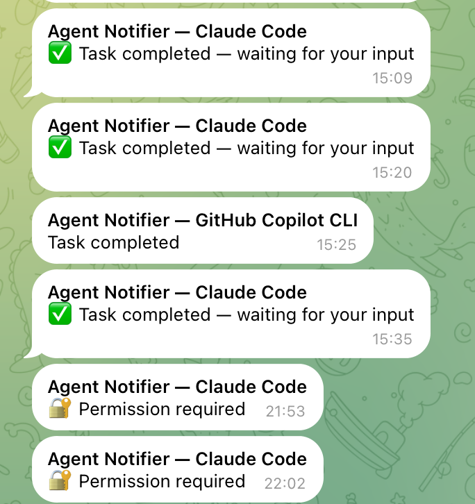

# AI Skills

A collection of useful skills for AI agents (like Claude Code/ Codex/ GitHub Copilot CLI), following the [Agent Skills specification](https://agentskills.io/specification).

## Skills

| Skill | Description | Screenshot |
|-------|-------------|------------|
| [Image Uploader](skills/image-uploader/SKILL.md) | Upload local images to cloud hosting (sm.ms) and get public URLs | |
| [Cover Generator](skills/cover-generator/SKILL.md) | Generate gradient-based cover images (1200x630) with custom title, subtitle, and theme | |
| [Auto Blog Cover](skills/auto-blog-cover/SKILL.md) | End-to-end blog cover automation: parse markdown frontmatter, generate cover, upload, and update fields | |
| [Session Export](skills/session-export/SKILL.md) | Export AI chat sessions to readable Markdown files with optional summarization | |
| [Agent Notifier](skills/agent-notifier/SKILL.md) | Multi-channel notifications (sound, macOS alert, Telegram, Email, Slack, Discord) when your AI agent needs input or finishes a task | |


## Installation

### Skills CLI (Recommended)

Install all skills at once using the [Skills CLI](https://skills.sh/):

```bash
npx skills add crossoverJie/skills
```

Or install a specific skill:

```bash
npx skills add crossoverJie/skills@image-uploader
npx skills add crossoverJie/skills@cover-generator
npx skills add crossoverJie/skills@auto-blog-cover
npx skills add crossoverJie/skills@session-export
npx skills add crossoverJie/skills@agent-notifier
```

The CLI automatically detects your agent (Claude Code, Codex, Cursor, etc.) and installs to the correct location.

### Manual Installation

#### Claude Code

To make these skills available to Claude Code agents, copy the `skills` directory to your global configuration folder:

```bash
# Create the directory if it doesn't exist
mkdir -p ~/.claude/skills

# Copy skills (assuming you are in the repo root)
cp -r skills/* ~/.claude/skills/
```

Once installed, Claude will automatically discover these skills when you ask for relevant tasks (e.g., "Upload this image").

#### GitHub Copilot CLI / Terminal

1.  **Clone the repository**:
    ```bash
    git clone git@github.com:crossoverJie/skills.git ~/skills
    ```

2.  **Install Dependencies**:
    ```bash
    pip install -r ~/skills/skills/image-uploader/requirements.txt
    pip install -r ~/skills/skills/cover-generator/requirements.txt
    pip install -r ~/skills/skills/auto-blog-cover/requirements.txt
    ```

3.  **Usage**:
    You can run the scripts directly from the CLI.
    ```bash
    python3 ~/skills/skills/auto-blog-cover/auto_blog_cover.py post.md
    ```
## Usage

Each skill has its own documentation and requirements.

### Quick Start

1.  **Image Uploader**:
    ```bash
    python3 skills/image-uploader/image_uploader.py path/to/image.png
    ```

2.  **Cover Generator**:
    ```bash
    python3 skills/cover-generator/cover_generator.py "My Title" --upload
    ```

3.  **Session Export**:
    ```bash
    python3 skills/session-export/session_export.py --output-dir ./exports --name "my-session"
    ```

4.  **Agent Notifier**:
    ```bash
    python3 skills/agent-notifier/setup.py
    ```
