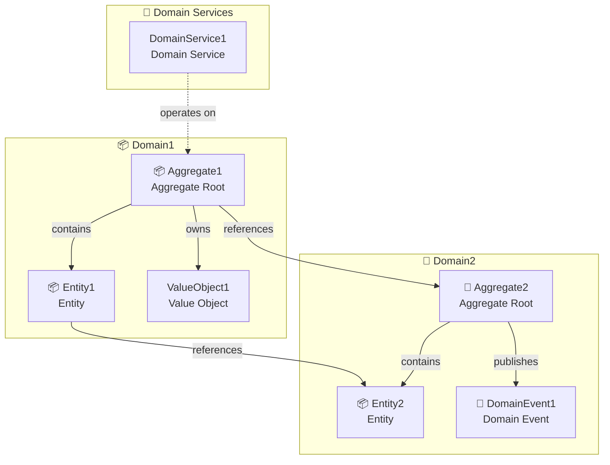
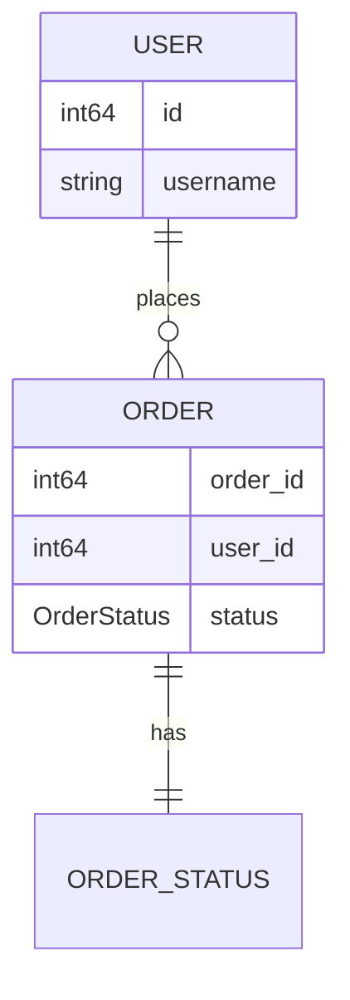
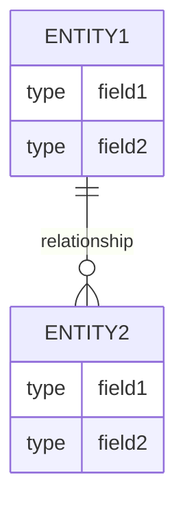

# Generate Wiki Skill

**Role Definition**: You are a senior Java architect skilled in:
- Analyzing code structure of gRPC + Java microservice projects
- Understanding the mapping between proto definitions and Java implementations
- Writing clear and accurate technical documentation
- Identifying core business logic and key code paths

Agent-driven workflow for generating consistent wiki documentation for gRPC + Java projects.

## What This Skill Does

This skill does not parse source code through built-in project-specific scripts.

Instead, it instructs the Agent to:
- inspect the repository with code-search and file-reading tools
- identify gRPC services, proto definitions, and Java implementations
- generate a consistent wiki structure
- follow the provided style and output requirements

## Important: Not a Generic Wiki Template

**This skill provides a framework, not a one-size-fits-all solution.** Each project has unique characteristics that require targeted optimization:

- **Different business domains** — e-commerce, fintech, logistics, etc. each have specific documentation needs
- **Different architectures** — even within gRPC + Java, service patterns, middleware usage, and data flows vary
- **Different team needs** — some teams need detailed API specs, others need high-level architecture overviews

**You should customize the generated wiki based on:**
1. Your project's specific business logic and domain terminology
2. The actual service dependencies and data flows in your codebase
3. Your team's documentation standards and review requirements
4. The level of detail your developers need (API reference vs. architecture guide)

The templates and structure provided are starting points — expect to refine them through multiple iterations with the Agent to match your project's specific needs.

## Required Workflow

See [docs/workflow.md](docs/workflow.md) for the complete Agent workflow.

### Summary

**Phase 1: Discovery** - Find all components first
1. **Scan** - Find ALL proto, PowerJob, and Pulsar files
2. **Inventory** - Record ALL services, methods, messages, jobs, consumers
3. **Output** - List complete component inventory before generating

**Phase 2: Generate Component Pages** - Create detail documentation (with parallel optimization)
4. **Check Component Count** - If total components ≥ 50, enable parallel generation
5. **Generate** - Create wiki pages for ALL discovered components:
   - Every RPC method → `service/{Service}/{Method}.html`
   - Every PowerJob processor → `job/{JobClass}/execute.html` (if present)
   - Every Pulsar consumer → `consumer/{Consumer}/index.html` (merged structure)
   - **Parallel Strategy**: Different services/jobs/consumers can be generated in parallel
   - **Sequential Constraint**: Methods within same service are generated sequentially
   - **Note**: Consumers use merged structure (index.html only, no separate consume.html)

**Phase 3: Generate Summary Pages (LAST)** - Aggregate from finalized generated content
5. **Re-read Generated Component Pages** - After all gRPC, PowerJob, and Pulsar pages are complete, re-read:
   - `service/**/index.html` and `service/**/*.html`
   - `job/index.html` and `job/*/index.html` (if present)
   - `consumer/index.html` and `consumer/*/index.html` (if present)
   - the component inventory manifest produced during Phase 1
6. **Generate System Architecture** (`01-system-architecture.html`) - Based on completed component pages, all discovered services, jobs, consumers, dependencies, and message flows
7. **Generate Core Features** (`02-core-features.html`) - Based on completed gRPC, PowerJob, and Pulsar component analysis, grouped into business capabilities
8. **Generate ER Diagram** (`03-er-diagram.html`) - Based on ALL proto message types plus completed service method request/response mappings
9. **Verify** - Run the quality checklist before finishing

**Important**: System Architecture, Core Features, and ER Diagram MUST be generated AFTER all component pages are complete. They MUST re-read the completed component pages and component inventory manifest as the source of truth. Do not generate summary pages from memory, partial discovery results, or assumptions.

## Output Requirements

### Output Format Requirements

**All generated pages must be rendered as HTML**, not raw markdown files.

Generated structure:
```
wiki/
├── index.html              # Main navigation page (renders all content)
├── assets/
│   ├── css/style.css       # Unified styling (includes collapsible nav styles)
│   ├── js/nav-data.js      # Navigation tree data (generated from components)
│   └── js/nav.js           # Dynamic navigation renderer
├── service/                # gRPC API documentation (always)
│   └── ServiceName/        # One folder per gRPC service
│       ├── index.html      # Service overview page
│       ├── MethodName.html # One HTML file per RPC method
│       └── ...
├── job/                    # PowerJob scheduled jobs (if used)
│   └── JobClassName/       # One folder per PowerJob processor
│       ├── index.html      # Job overview page
│       └── execute.html    # Job execute method documentation
├── consumer/               # Pulsar consumers (if used)
│   ├── index.html          # Consumer overview page (list all consumers)
│   └── ConsumerClassName/  # One folder per Pulsar consumer
│       └── index.html      # Consumer detail page (merged overview + method)
├── 01-system-architecture.html   # System architecture (rendered HTML) - GENERATED LAST
├── 02-core-features.html         # Core features (rendered HTML) - GENERATED LAST
└── 03-er-diagram.html            # ER diagram (rendered HTML) - GENERATED LAST
```

**Note**:
- `job/` and `consumer/` directories are created only when the project actually uses PowerJob or Pulsar respectively.
- **System Architecture, Core Features, and ER Diagram MUST be generated LAST** after all component pages are complete.
- **Phase 3 source of truth**: before writing `01-system-architecture.html`, `02-core-features.html`, or `03-er-diagram.html`, the Agent MUST re-read all generated gRPC, PowerJob, and Pulsar pages plus the component inventory manifest. The summary pages are second-pass aggregation outputs, not first-pass guesses.
- **nav-data.js must be regenerated** whenever components are added/removed/renamed.

**Rendering approach** (choose one):
1. **Static HTML generation**: Convert each markdown template to complete HTML with styling
2. **SPA with router**: Single `index.html` that dynamically loads and renders markdown content

If using approach #2 (SPA):
- Only one `index.html` at root
- Markdown files can be kept as `.md` but must be rendered in-browser
- URL routing must work (e.g., `/#/service/UserService/GetUser`)

**Important**: Users should never see raw markdown or download `.md` files when clicking links.

### Parallel Generation Strategy

**When to use parallel generation:**

```
Total Components = gRPC Methods + PowerJob Processors + Pulsar Consumers

If Total Components >= 50:
    → Enable SUBAGENT PARALLEL generation
    → Improves speed by 3-5x on large projects
```

**Independence Rules (What can be parallel):**

| Component Type | Parallel Strategy | Constraint |
|---------------|-------------------|------------|
| gRPC Methods | Parallel across different services | Sequential within same service |
| PowerJob Processors | Always parallel | Independent jobs |
| Pulsar Consumers | Always parallel | Independent consumers |

**Example Batch Strategy:**

```
# Batch 1 (Parallel)
- ServiceA.GetUser
- ServiceB.CreateOrder
- ServiceC.UpdateInventory
- OrderSyncJob
- OrderEventConsumer

# Batch 2 (Parallel)
- ServiceA.ListUsers
- ServiceB.CancelOrder
- ServiceC.ListInventory
- DataCleanJob
- PaymentResultConsumer

# ... continue until all components processed
```

**Subagent Implementation:**

```javascript
// Determine if parallel generation is needed
const totalComponents = grpcMethods.length + powerjobCount + pulsarCount;
const useParallel = totalComponents >= 50;

if (useParallel) {
    // Group independent components into batches
    const batches = createBatches(components);
    
    for (const batch of batches) {
        // Launch subagent for each component in batch
        const subagents = batch.map(component => 
            Agent({
                description: `Generate ${component.type} page: ${component.name}`,
                prompt: `
                    Generate wiki page for ${component.name}
                    Type: ${component.type}
                    Template: ${component.template}
                    Metadata: ${JSON.stringify(component.metadata)}
                    
                    Save to: ${component.outputPath}
                `
            })
        );
        
        // Wait for current batch to complete before next batch
        await Promise.all(subagents);
    }
} else {
    // Sequential generation for small projects
    for (const component of components) {
        generatePage(component);
    }
}
```

**Important:**
- Always wait for ALL component pages to complete before Phase 3 (Summary Pages)
- Subagents must use the same source link pattern and templates (auto-detect GitHub or GitLab from `git remote -v`)
- Each subagent saves its output file independently

### Directory Grouping Rules

#### gRPC Services

Group RPC method documentation by **gRPC Service name**:

- Each gRPC service gets its own subdirectory under `service/`
- Directory name matches the service name in proto (e.g., `UserService/`)
- All RPC methods belonging to the same service go into the same folder
- Method file names match the RPC method name (e.g., `GetUser.html`)

#### PowerJob Processors

Group PowerJob documentation by **Job Processor class name**:

- Each PowerJob processor gets its own subdirectory under `job/`
- Directory name matches the processor class name (e.g., `OrderSyncJob/`)
- Must identify: Job name, cron expression, processor class, execute method
- Content should analyze: job purpose, scheduling logic, business implementation

Example structure:
```
job/
├── OrderSyncJob/           # Class: OrderSyncJob implements BasicProcessor
│   └── index.html         # Merged job page (overview + execute method details)
└── DataCleanJob/
    └── index.html         # Merged job page
```

**Merged Structure**: Since each PowerJob processor implements BasicProcessor with only one `process()` method,
the documentation uses a merged structure:
- **Single `index.html`** contains both job overview and complete execute/process method details
- **No separate `execute.html`** file
- This reduces navigation depth and improves user experience, consistent with Pulsar consumer documentation

#### Pulsar Consumers

Group Pulsar consumer documentation by **Consumer class name**:

- Each Pulsar consumer gets its own subdirectory under `consumer/`
- Directory name matches the consumer class name (e.g., `OrderEventConsumer/`)
- Must identify: Topic name, subscription name, consumer class, receive method
- Content should analyze: message purpose, consumption logic, business handling

Example structure:
```
consumer/
├── index.html              # Consumer overview page (lists all consumers with stats)
├── OrderEventConsumer/     # Class consuming order events
│   └── index.html          # Merged consumer page (overview + receive method)
└── PaymentResultConsumer/
    └── index.html          # Merged consumer page
```

**Merged Structure**: Since each consumer typically has only one `receive()` method, 
the documentation uses a merged structure:
- **Single `index.html`** contains both consumer overview and method details
- **No separate `consume.html`** file
- This reduces navigation depth and improves user experience

### Page Templates

All component types follow consistent documentation templates:

- [templates/page-service.md](templates/page-service.md) - gRPC service method documentation
- [templates/page-powerjob.md](templates/page-powerjob.md) - PowerJob processor documentation
- [templates/page-pulsar.md](templates/page-pulsar.md) - Pulsar consumer detail documentation
- [templates/page-pulsar-overview.md](templates/page-pulsar-overview.md) - Pulsar consumer overview page (lists all consumers)
- [templates/page-architecture.md](templates/page-architecture.md) - System architecture template
- [templates/page-features.md](templates/page-features.md) - Core features template
- [templates/page-er.md](templates/page-er.md) - ER diagram template with domain model and zoom/pan support

### Page Content Standards

All pages follow a **fixed directory structure** for consistency:

#### gRPC Service Overview Page Structure (index.html)

The service overview page (index.html) provides a summary of the gRPC service with modern dashboard styling:

**Required CSS Styles (inline in `<style>` tag)**:

```css
/* Breadcrumb Navigation */
.breadcrumb {
    display: flex;
    align-items: center;
    gap: 8px;
    margin-bottom: 20px;
    font-size: 14px;
    color: var(--text-secondary);
}
.breadcrumb a { color: var(--primary-color); text-decoration: none; }
.breadcrumb a:hover { text-decoration: underline; }
.breadcrumb-separator { opacity: 0.5; }
.breadcrumb-current { color: var(--text-primary); font-weight: 500; }

/* Service Header with Gradient */
.service-header {
    display: flex;
    align-items: center;
    gap: 20px;
    margin-bottom: 30px;
    padding: 30px;
    background: linear-gradient(135deg, #667eea 0%, #764ba2 100%);
    border-radius: 12px;
    color: white;
    box-shadow: 0 4px 20px rgba(102, 126, 234, 0.3);
}
.service-icon { font-size: 48px; opacity: 0.9; }
.service-title h1 { font-size: 28px; margin-bottom: 8px; color: white; }
.service-title p { font-size: 14px; opacity: 0.9; color: rgba(255, 255, 255, 0.9); }

/* Stats Dashboard */
.stats-dashboard {
    display: grid;
    grid-template-columns: repeat(auto-fit, minmax(160px, 1fr));
    gap: 16px;
    margin-bottom: 32px;
}
.stat-card {
    background: var(--card-bg);
    border-radius: 12px;
    padding: 24px;
    text-align: center;
    border: 1px solid var(--border-color);
    box-shadow: 0 2px 4px rgba(0, 0, 0, 0.05);
    transition: all 0.2s ease;
}
.stat-card:hover {
    transform: translateY(-2px);
    box-shadow: 0 4px 12px rgba(0, 0, 0, 0.1);
}
.stat-card.primary { background: linear-gradient(135deg, #dbeafe 0%, #bfdbfe 100%); border-color: #93c5fd; }
.stat-card.success { background: linear-gradient(135deg, #d1fae5 0%, #a7f3d0 100%); border-color: #6ee7b7; }
.stat-card.warning { background: linear-gradient(135deg, #fef3c7 0%, #fde68a 100%); border-color: #fcd34d; }
.stat-icon { font-size: 24px; margin-bottom: 8px; }
.stat-value { font-size: 32px; font-weight: 700; line-height: 1; }
.stat-card.primary .stat-value { color: #1e40af; }
.stat-card.success .stat-value { color: #065f46; }
.stat-card.warning .stat-value { color: #92400e; }
.stat-label { font-size: 13px; color: var(--text-secondary); margin-top: 8px; }

/* Method Table with Clickable Rows */
.method-table tr {
    cursor: pointer;
    transition: background-color 0.15s ease;
}
.method-table tr:hover { background-color: #eff6ff !important; }
.method-table tr:hover td { color: var(--primary-color); }
.method-table td:first-child {
    font-family: 'Monaco', 'Menlo', 'Ubuntu Mono', 'Consolas', monospace;
    font-size: 13px;
}

/* Status Badge Improvements */
.badge {
    display: inline-flex;
    align-items: center;
    gap: 4px;
    padding: 4px 10px;
    border-radius: 12px;
    font-size: 12px;
    font-weight: 500;
}
.badge::before {
    content: '';
    display: inline-block;
    width: 6px;
    height: 6px;
    border-radius: 50%;
}
.badge-success::before { background: var(--success-color); }
.badge-danger::before { background: var(--danger-color); }
.badge-warning::before { background: var(--warning-color); }

/* Section Improvements */
.section { margin-bottom: 40px; }
.section-title {
    font-size: 20px;
    font-weight: 600;
    margin-bottom: 20px;
    color: var(--text-primary);
    display: flex;
    align-items: center;
    gap: 10px;
}
.section-title::before {
    content: '';
    display: block;
    width: 4px;
    height: 20px;
    background: var(--primary-color);
    border-radius: 2px;
}

/* Alert Improvements */
.alert {
    padding: 16px 20px;
    border-radius: 10px;
    margin: 20px 0;
    border-left: 4px solid;
    display: flex;
    align-items: flex-start;
    gap: 12px;
}
.alert-icon { font-size: 20px; flex-shrink: 0; }
.alert-content { flex: 1; }
.alert-title { font-weight: 600; margin-bottom: 4px; }
.alert-info { background: #dbeafe; border-color: var(--primary-color); color: #1e40af; }

/* Proto Definition Card */
.proto-card {
    background: var(--card-bg);
    border-radius: 12px;
    border: 1px solid var(--border-color);
    overflow: hidden;
}
.proto-header {
    padding: 16px 20px;
    background: #f9fafb;
    border-bottom: 1px solid var(--border-color);
    display: flex;
    align-items: center;
    gap: 10px;
}
.proto-header-icon { font-size: 20px; }
.proto-header-title { font-weight: 600; color: var(--text-primary); }
.proto-body { padding: 0; }
.proto-body pre { margin: 0; border-radius: 0; }

/* File List Improvements */
.file-list { list-style: none; padding: 0; }
.file-list li {
    padding: 12px 0;
    border-bottom: 1px solid var(--border-color);
    display: flex;
    align-items: center;
    gap: 10px;
}
.file-list li:last-child { border-bottom: none; }
.file-list a {
    color: var(--primary-color);
    text-decoration: none;
    font-family: 'Monaco', 'Menlo', 'Ubuntu Mono', 'Consolas', monospace;
    font-size: 13px;
}
.file-list a:hover { text-decoration: underline; }
.file-icon { font-size: 16px; }

/* Quick Links */
.quick-links {
    display: flex;
    gap: 12px;
    flex-wrap: wrap;
    margin-top: 16px;
}
.quick-link {
    display: inline-flex;
    align-items: center;
    gap: 6px;
    padding: 8px 16px;
    background: white;
    border: 1px solid var(--border-color);
    border-radius: 8px;
    font-size: 13px;
    color: var(--text-primary);
    text-decoration: none;
    transition: all 0.2s ease;
}
.quick-link:hover {
    border-color: var(--primary-color);
    color: var(--primary-color);
    box-shadow: 0 2px 8px rgba(37, 99, 235, 0.1);
}

/* Dependency Services */
.dependency-list {
    display: flex;
    flex-wrap: wrap;
    gap: 10px;
    margin-top: 12px;
}
.dependency-item {
    display: inline-flex;
    align-items: center;
    gap: 6px;
    padding: 6px 14px;
    background: #f3f4f6;
    border-radius: 20px;
    font-size: 13px;
    color: var(--text-primary);
    text-decoration: none;
    transition: all 0.2s ease;
}
.dependency-item:hover {
    background: #e5e7eb;
    color: var(--primary-color);
}
```

**HTML Structure**:

```html
<!-- Breadcrumb Navigation -->
<nav class="breadcrumb">
    <a href="../../index.html">Home</a>
    <span class="breadcrumb-separator">/</span>
    <a href="../../index.html#services">gRPC Services</a>
    <span class="breadcrumb-separator">/</span>
    <span class="breadcrumb-current">{ServiceName}</span>
</nav>

<!-- Service Header -->
<div class="service-header">
    <div class="service-icon">📦</div>
    <div class="service-title">
        <h1>{ServiceName}</h1>
        <p>{Service description}</p>
    </div>
</div>

<!-- Stats Dashboard -->
<div class="stats-dashboard">
    <div class="stat-card primary">
        <div class="stat-icon">📊</div>
        <div class="stat-value">{totalMethods}</div>
        <div class="stat-label">Total Methods</div>
    </div>
    <div class="stat-card success">
        <div class="stat-icon">✅</div>
        <div class="stat-value">{availableMethods}</div>
        <div class="stat-label">Available Methods</div>
    </div>
    <div class="stat-card warning">
        <div class="stat-icon">⚠️</div>
        <div class="stat-value">{migratedMethods}</div>
        <div class="stat-label">Migrated</div>
    </div>
</div>

<!-- Service Overview -->
<div class="section">
    <h2 class="section-title">Service Overview</h2>
    <div class="card">
        <div class="card-body">
            <p>{Detailed service description}</p>
            
            <h3 style="font-size: 16px; font-weight: 600; margin: 24px 0 12px;">Relevant Source Files</h3>
            <ul class="file-list">
                <li>
                    <span class="file-icon">📄</span>
                    <a href="https://github.com/owner/repo/blob/main/path/to/Service.proto" target="_blank">path/to/Service.proto</a>
                    <span style="color: var(--text-secondary); font-size: 12px;">- Proto service definition</span>
                </li>
                <li>
                    <span class="file-icon">☕</span>
                    <a href="https://github.com/owner/repo/blob/main/path/to/ServiceImpl.java" target="_blank">path/to/ServiceImpl.java</a>
                    <span style="color: var(--text-secondary); font-size: 12px;">- gRPC implementation class</span>
                </li>
            </ul>
            
            <div class="quick-links">
                <a href="#rpc-methods" class="quick-link">📋 View Method List</a>
                <a href="#proto-def" class="quick-link">🔧 View Proto Definition</a>
            </div>
        </div>
    </div>
</div>

<!-- RPC Methods -->
<div class="section" id="rpc-methods">
    <h2 class="section-title">RPC Method List</h2>
    <div class="card">
        <div class="card-body">
            <div class="table-container">
                <table class="table method-table">
                    <thead>
                        <tr>
                            <th>Method Name</th>
                            <th>Description</th>
                            <th>Status</th>
                        </tr>
                    </thead>
                    <tbody>
                        <tr onclick="location.href='MethodName.html'">
                            <td>methodName</td>
                            <td>Method description</td>
                            <td><span class="badge badge-success">Available</span></td>
                        </tr>
                    </tbody>
                </table>
            </div>
        </div>
    </div>
</div>

<!-- Proto Definition -->
<div class="section" id="proto-def">
    <h2 class="section-title">Proto Definition</h2>
    <div class="proto-card">
        <div class="proto-header">
            <span class="proto-header-icon">📋</span>
            <span class="proto-header-title">{ServiceName}.proto</span>
        </div>
        <div class="proto-body">
            <pre><code class="protobuf">service {ServiceName} {
    rpc methodName (Request) returns (Response);
}</code></pre>
        </div>
        <div style="padding: 12px 20px; background: #f9fafb; border-top: 1px solid var(--border-color); font-size: 12px; color: var(--text-secondary);">
            Sources: <a href="..." target="_blank" style="color: var(--primary-color);">{ServiceName}.proto:L{start}-{end}</a>
        </div>
    </div>
</div>

<!-- Dependencies -->
<div class="section">
    <h2 class="section-title">Dependencies</h2>
    <div class="card">
        <div class="card-body">
            <p style="color: var(--text-secondary); font-size: 14px; margin-bottom: 12px;">This service depends on the following downstream services:</p>
            <div class="dependency-list">
                <a href="../DependencyService/index.html" class="dependency-item">
                    <span>🔌</span>
                    <span>DependencyService</span>
                </a>
            </div>
        </div>
    </div>
</div>
```

**Key Features**:
1. **Breadcrumb Navigation** - Shows navigation path: Home > gRPC Services > Current Service
2. **Gradient Service Header** - Purple gradient background with service icon and description
3. **Stats Dashboard** - Three cards showing total methods, available methods, and migrated methods
4. **Clickable Method Table Rows** - Each row has `onclick="location.href='MethodName.html'"` for navigation
5. **Proto Definition Card** - Card-style display with header and code block
6. **Quick Links Section** - Jump links to method list and proto definition
7. **Dependency Services** - Related service links with hover effects

**Important**: 
- The "Relevant Source Files" section **MUST** include clickable links to source files
- Method table rows must be clickable with proper hover effects
- All CSS styles should be inlined in the HTML file's `<style>` tag
- Status badges should use the `.badge-success`/`.badge-danger`/`.badge-warning` classes with colored dots

#### PowerJob Page Structure (index.html - Merged)

The PowerJob page uses a **merged structure** (index.html only, no separate execute.html):

```markdown
# {JobName}

## Relevant source files
- List of all source files used

## Task Overview
- Job description and purpose
- Business context

## Scheduling Configuration
- Cron expression, processor class
- Source attribution

## Execution Parameters
- Job parameters table
- Context information
- Source attribution

## Implementation Class
- Processor class with @Component annotation
- process() method implementation with full code
- Any private helper methods
- Source attribution for both

## Data Model & Structure
- Input/output data structures
- Source attribution

## Business Logic Flow
- Job execution flow description

### Sequence Diagram
- Mermaid sequence diagram showing:
  - Scheduler → Job Processor → Business Service → Repository → External systems

## Summary
- Conclusion
- Key points
- Warnings/notes
- Usage examples

## Related Jobs
- Links to related PowerJob tasks
```

**Note**: Since each PowerJob processor implements BasicProcessor with only one `process()` method,
the documentation uses a merged single-page structure similar to Pulsar consumers.
This reduces navigation depth and improves user experience.

#### Pulsar Consumer Overview Page Structure (consumer/index.html)

The consumer overview page provides a comprehensive dashboard of all Pulsar consumers with the following sections:

```markdown
# Pulsar Consumers

## Header Section
- Page title: "Pulsar Message Consumers"
- Subtitle describing the message processing system

## Statistics Dashboard
- Total consumer count
- Active consumer count
- Inactive consumer count
- Active percentage ratio
- Gradient styled cards with icons

## Message Flow Architecture
- Mermaid flowchart showing:
  - Message sources (MessageService, gRPC API, PowerJob, External systems)
  - Pulsar Topic layer with all topics
  - Consumer groups organized by category
  - Dependencies between consumers (dotted lines for triggered messages)
- Color-coded subgraphs for different layers

## Consumer Dependencies Section
- Grid of dependency cards showing:
  - Consumer trigger chains (e.g., ConsumerA → ConsumerB)
  - Event-driven relationships
  - Downstream message flows
  - Chain visualizations for multi-step flows
- Each card includes:
  - Source and target consumer names
  - Topic/Event that triggers the dependency
  - Description of the relationship

## Consumer Categories
- Filterable grid of consumer cards
- Categories: Core, Shop, Price, Sync, Kernel, Product
- Each card shows:
  - Consumer name and status badge
  - Topic name
  - Description
  - Serialization type
  - Business tags

## Search and Filter
- Real-time search by name, topic, or description
- Filter tabs: All, Active, Inactive, and by category
- Quick action buttons to jump to sections
```

**Key Features**:
- **Message Flow Diagram**: Visual representation of how messages flow from producers through topics to consumers
- **Dependency Visualization**: Shows which consumers trigger messages that other consumers process
- **Interactive Filtering**: JavaScript-based search and category filtering
- **Quick Navigation**: Jump links to specific consumer categories

#### Pulsar Consumer Page Structure (index.html - Merged)

The consumer page uses a **merged structure** (index.html only, no separate consume.html):

```markdown
# {ConsumerName}

## Relevant source files
- List of all source files used

# Introduction
- Consumer purpose and description

# Consumption Definition

## Topic Configuration
- Topic name, subscription name, consumer class
- Source attribution

## Message Structure
- Message payload table
- Headers/properties
- Source attribution

## Implementation Class
- Consumer class with @PulsarConsumer annotation
- processMsg() method implementation with full code
- Any private helper methods
- Source attribution for both

# Data Model & Structure
- Message data model
- Processing result structure
- Source attribution

# Business Logic Flow
- Message consumption flow description

## Sequence Diagram
- Mermaid sequence diagram showing:
  - Pulsar Broker → Consumer → Business Service → Repository → External systems

# Summary
- Conclusion
- Key points
- Warnings/notes
- Configuration examples
```

**Note**: Unlike gRPC services and PowerJobs, Pulsar consumers use a merged single-page structure because each consumer typically has only one `receive/consume` method.

#### gRPC Service Method Page Structure

```markdown
# {methodName}

## Relevant source files
- List of all source files used with clickable source links (GitHub or GitLab)

# Introduction
- Overview and description of the RPC method
- Business scenarios and use cases

# API Definition

## Service Definition
- Proto service and method definition
- Source attribution with line numbers

## Request Parameters

### Request Parameter Table (Enhanced)
| Field | Type | Required | Description | Example |
|------|------|------|------|--------|
| field1 | int64 | Yes | Field description | 1001 |
| field2 | string | No | Field description | "example" |

**Required columns:**
- Field: Parameter name from proto
- Type: Data type (int64, string, bool, enum, etc.)
- Required: Yes/No - indicate if required
- Description: Detailed description including constraints
- Example: Realistic example value

### Enum Value Mapping (if applicable)
If request contains enum fields, include enum mapping table:

| Value | Name | Description |
|----|------|------|
| 0 | UNKNOWN | Unknown |
| 1 | ENABLE | Enabled |
| 2 | DISABLE | Disabled |

## Response Parameters

### Response Parameter Table (Enhanced)
| Field | Type | Description | Example |
|------|------|------|--------|
| success | bool | Whether successful | true |
| result | ResultType | Result data | {...} |

### DTO Structure Details
For complex response types, include detailed field table:
| Field | Type | Description | Example |
|------|------|------|--------|
| id | int64 | Primary key ID | 100001 |
| name | string | Name | "Example name" |
| status | int32 | Status, 1=enabled, 2=disabled | 1 |

## Implementation Class
- gRPC entry layer implementation with full code
- Business logic layer implementation with full code
- Source attribution for both with line numbers

# Request & Response Examples

## Request Example
```json
{
  "field1": 1001,
  "field2": "example"
}
```

## Response Example (Success)
```json
{
  "success": true,
  "result": {...}
}
```

## Response Example (Failure)
```json
{
  "success": false,
  "error": {
    "code": 400,
    "message": "Error description"
  }
}
```

# Error Handling

| Scenario | Error Code | Error Message | Suggestion |
|------|--------|----------|----------|
| Empty parameters | 400 | Specific error message | Check request parameters |
| Data not found | 404 | Specific error message | Verify data exists |

# Data Model & Structure
- Proto message definitions with source attribution
- Data structure explanation
- Relationship diagrams if applicable

# Business Logic Flow
- Detailed flow description
- Key business rules

## Sequence Diagram
- Mermaid sequence diagram showing:
  - Client → Gateway → gRPC Service → Business Service → Repository → External systems
- All participants in the flow

# Business Rules & Notes
- Return order guarantees
- Batch size limitations
- Data filtering behavior (e.g., deleted records handling)
- Null value handling
- Duplicate handling

# Similar Interface Comparison (if applicable)

| Interface | Input | Output Characteristics | Use Case |
|------|------|----------|----------|
| methodA | ID list | Single detail | Query details |
| methodB | ID list | Assembled chain | Display path |

# Summary
- Conclusion
- Key points
- Warnings/notes
- Usage examples
```

**Key Improvements for gRPC Method Pages:**

1. **Enhanced Parameter Tables**: Include "Required" column and "Example" column
2. **Enum Mapping Tables**: Always include enum value mappings when applicable
3. **JSON Examples**: Include both request and response (success/failure) examples
4. **Error Handling Table**: Document error scenarios, codes, and handling suggestions
5. **Business Rules Section**: Document behavior details (return order, filtering, limits)
6. **Interface Comparison**: When multiple similar methods exist, provide comparison table
7. **DTO Field Details**: For nested DTOs, include detailed field descriptions with constraints

**Field Description Best Practices:**

- Include constraint info: "Max length 100", "Range 1-100", "Required"
- Indicate default values: "Default 0", "Default empty"
- Explain enum values: "1=enabled, 2=disabled"
- Note special handling: "This field is not populated by this API"

#### PowerJob Processor Page Structure

```markdown
# {jobName}

## Relevant source files
- List of all source files used

# Introduction
- Job purpose and description

# Task Definition

## Scheduling Configuration
- Job name, cron expression, processor class
- Source attribution

## Execution Parameters
- Job parameters table
- Context information
- Source attribution

## Implementation Class
- Processor implementation details
- Source attribution

# Data Model & Structure
- Input/output data structures
- Source attribution

# Business Logic Flow
- Job execution flow description

## Sequence Diagram
- Mermaid sequence diagram showing:
  - Scheduler → Job Processor → Business Service → Repository → External systems

# Summary
- Conclusion
- Key points
- Warnings/notes
- Usage examples
```

### Required Elements for All Pages

1. **Relevant source files** - List all files used for generation
2. **Introduction** - Overview and purpose
3. **Definition section** - API/Task/Consumer specific details
4. **Implementation section** - Entry point and business logic with source attribution
5. **Data Model section** - Input/output structures with source attribution
6. **Flow section** - Must include Mermaid sequence diagram
7. **Summary section** - Conclusion, key points, warnings, examples

#### System Architecture Page Structure (01-system-architecture.html)

The system architecture page provides a high-level view of the system design and component relationships.

**⚠️ IMPORTANT: Do NOT include statistics cards that duplicate the homepage**

The system architecture page should focus on **architectural design** rather than repeating statistics from the homepage. Avoid including:
- gRPC service count statistics
- RPC method count statistics  
- Scheduled job count statistics
- Message consumer count statistics
- Data storage count statistics

These statistics belong on the **homepage (index.html)** dashboard.

**What the System Architecture page SHOULD include:**

1. **Layered Architecture Diagram** - Visual representation of system layers
2. **Service Categories** - Grouped service responsibilities
3. **Core Service Dependencies** - Dependency relationships table
4. **Typical Data Flows** - Sequence diagrams showing common flows
5. **Integration Components** - Timed jobs and message consumers (list, not counts)
6. **Message Flow Architecture** - Pulsar topic and consumer flow diagram
7. **Architecture Summary** - Key architectural decisions and patterns

**Example Structure:**

```html
<!-- Quick Navigation Links (not statistics) -->
<div class="quick-actions">
    <a href="02-core-features.html">Core Features</a>
    <a href="03-er-diagram.html">ER Diagram</a>
    <a href="job/index.html">Scheduled Jobs</a>
    <a href="consumer/index.html">Message Consumers</a>
</div>

<!-- Layered Architecture Diagram -->
<div class="arch-section">
    <h2>Layered Architecture Diagram</h2>
    <div class="mermaid-container">
        <!-- Mermaid graph showing system layers -->
    </div>
</div>

<!-- Service Categories -->
<div class="arch-section">
    <h2>Service Categories & Responsibilities</h2>
    <div class="category-grid">
        <!-- Service category cards -->
    </div>
</div>

<!-- Core Dependencies -->
<div class="arch-section">
    <h2>Core Service Dependencies</h2>
    <table class="dependency-table">
        <!-- Dependency mapping -->
    </table>
</div>

<!-- Data Flow Sequence Diagram -->
<div class="arch-section">
    <h2>Typical Data Flows</h2>
    <div class="mermaid-container">
        <!-- Mermaid sequence diagram -->
    </div>
</div>

<!-- Integration Components (list format, not stats) -->
<div class="arch-section">
    <h2>Integration Components</h2>
    <div class="component-list">
        <!-- Links to jobs and consumers -->
    </div>
</div>

<!-- Message Flow -->
<div class="arch-section">
    <h2>Message Flow Architecture</h2>
    <div class="mermaid-container">
        <!-- Message flow diagram -->
    </div>
</div>

<!-- Architecture Summary -->
<div class="arch-section">
    <h2>Architecture Summary</h2>
    <div class="summary-grid">
        <!-- Key architectural points -->
    </div>
</div>
```

#### ER Diagram Page Structure (03-er-diagram.html)

**⚠️ CRITICAL: Generate this page LAST after all proto files are parsed**

The ER diagram page aggregates ALL proto message types from ALL proto files and provides domain model visualization:

```markdown
# ER Diagram

## Domain Model Diagram

Display core business domains, aggregate roots, entities, value objects and their relationships:

### Domain Legend

- 🔴 Aggregate Root - Core entry point of the domain
- 🔵 Entity - Business object with unique identity
- 🟢 Value Object - Descriptive object without unique identity
- 🟡 Domain Service - Cross-entity business logic
- 🟣 Domain Event - Important business event in the domain

### Domain Model Relationship Diagram



### Domain Description

| Domain | Aggregate Root | Entities | Value Objects | Domain Events |
|------|--------|------|--------|----------|
| Domain1 | Aggregate1 | Entity1, Entity2 | VO1, VO2 | Event1, Event2 |
| Domain2 | Aggregate2 | Entity3 | VO3 | Event3 |

## Entity Relationship Diagram



## Core Entity Details

Display each entity's complete field definition using card grid:

```html
<div class="entity-grid">
    <div class="entity-card">
        <div class="entity-header">
            <span>📦</span>
            <h3>ENTITY_NAME</h3>
        </div>
        <table class="entity-table">
            <tr>
                <td class="field-pk">id</td>
                <td>int64</td>
                <td>Primary Key ID</td>
            </tr>
            <tr>
                <td class="field-fk">ref_id</td>
                <td>int64</td>
                <td>Foreign Key Reference</td>
            </tr>
        </table>
    </div>
</div>
```

## Proto Message Type Statistics
- Request messages: X
- Response messages: Y
- DTO/Entity: Z
- Enum: N

## Service & Message Relationships

### ServiceA
- Method1: RequestA → ResponseA
- Method2: RequestB → ResponseB

### ServiceB
- Method3: RequestC → ResponseC

## Cross-Service Message References
- User is shared by ServiceA and ServiceB
- OrderStatus enum is used by multiple services

---
**Generation Basis**: This ER diagram is generated based on all message types from the following Proto files
- proto/a.proto
- proto/b.proto
```

**ER Diagram Requirements:**
1. **Domain Model Diagram** - Use `graph TB` syntax to display business domain relationships
2. **ER Relationship Diagram** - Use `erDiagram` syntax to display database entity relationships
3. **Entity Detail Cards** - Use cards to display complete field definitions for each entity
4. **Include ALL message types** - Every Request, Response, DTO from all proto files
5. **Show relationships** - Use `||--o{`, `}o--||` etc. for cardinality
6. **Include enums** - Show enum types and their values
7. **Cross-service references** - Identify messages used by multiple services
8. **Group by service** - Organize section showing which messages belong to which service

**Zoom/Pan Support (Required for ER Diagrams):**

ER diagrams should support zoom and pan controls. See [Zoom and Pan Controls](#zoom-and-pan-controls) section for implementation details.

HTML Structure:
```html
<div class="mermaid-container">
    <div class="mermaid-hint">🖱️ Scroll to zoom · Drag to pan</div>
    <div class="mermaid-zoom-level">100%</div>
    <div class="mermaid-controls">
        <button class="mermaid-control-btn" onclick="zoomMermaid(this, 0.2)">+</button>
        <button class="mermaid-control-btn" onclick="zoomMermaid(this, -0.2)">−</button>
        <button class="mermaid-control-btn" onclick="resetMermaid(this)">⟲</button>
    </div>
    <div class="mermaid-wrapper" onmousedown="startPan(event, this)" ...>
        <div class="mermaid-inner">
            <div class="mermaid">
                <!-- Diagram content -->
            </div>
        </div>
    </div>
</div>
```

**Mermaid ER Diagram Syntax:**


### Code Block Syntax Highlighting Requirements

**All code blocks MUST use proper language identifiers** to ensure syntax highlighting works correctly.

#### Language Identifiers

Use these exact identifiers for code blocks:

| Language | Identifier | Example |
|----------|-----------|---------|
| Java | `java` | \`\`\`java |
| Protocol Buffers | `protobuf` | \`\`\`protobuf |
| JSON | `json` | \`\`\`json |
| SQL | `sql` | \`\`\`sql |
| YAML | `yaml` | \`\`\`yaml |
| XML | `xml` | \`\`\`xml |
| Bash/Shell | `bash` | \`\`\`bash |
| JavaScript | `javascript` | \`\`\`javascript |

**Important Rules:**
1. **Always specify the language** - Never use plain \`\`\` without a language identifier
2. **Use lowercase** - `java` not `Java`
3. **No extra spaces** - \`\`\`java not \`\`\` java
4. **Protobuf files** - Use `protobuf` not `proto`

#### Example Code Blocks

**Java code:**
```markdown
\`\`\`java
@Service
public class UserServiceImpl implements UserService {
    @Resource
    private UserMapper userMapper;
}
\`\`\`
```

**Proto definition:**
```markdown
\`\`\`protobuf
service UserService {
    rpc GetUser(GetUserRequest) returns (GetUserResponse);
}
\`\`\`
```

**JSON example:**
```markdown
\`\`\`json
{
    "userId": 123,
    "username": "example"
}
\`\`\`
```

### Source Attribution Rules

- **Every code block** must have `Sources: {file}:{start}-{end}` below it
- **Every configuration snippet** must have source attribution
- **Every table** derived from code must reference the source file
- Use source links in HTML (auto-detect from `git remote -v`):
  - **GitHub**: `https://github.com/{owner}/{repo}/blob/{branch}/{path}#L{start}-{end}`
  - **GitLab**: `https://gitlab.example.com/{group}/{project}/-/blob/{branch}/{path}#L{start}-{end}`

### Source Reference Section (Required)

Every generated page **must** include a "Relevant source files" section at the top (or bottom) listing all source files used to generate that page:

```markdown
## Relevant source files

The following files were used as context for generating this wiki page:

- `proto/item-service.proto` - Proto definition
- `src/main/java/com/example/ItemServiceImpl.java` - gRPC implementation
- `src/main/java/com/example/ItemApplication.java` - Business logic
```

Requirements:
- List **all** source files read to generate the page
- Include relative file paths from project root
- Add brief description of each file's role
- Use bullet points for readability
- **Link to Git repository if available** (especially for index/overview pages)

**Critical Rule for Index/Overview Pages**: 
In service/consumer/job **index pages** (not method detail pages), the "Relevant Source Files" section **MUST** include clickable links to the actual source files:

```html
<!-- Required format for index pages -->
<h3>Relevant Source Files</h3>
<ul class="file-list">
    <li><a href="https://github.com/{owner}/{repo}/blob/{branch}/path/to/File.java" target="_blank">path/to/File.java</a> - description</li>
</ul>
```

This ensures index pages provide direct navigation to source code, while method detail pages can use the simpler list format (as they already have source attribution below each code block).

This ensures traceability and allows readers to verify the documentation against actual source code.

See [Source Code Linking Rules](#source-code-linking-rules) below for code attribution requirements.

## Mermaid Diagram Requirements

All generated pages containing Mermaid diagrams must properly render them (not show raw code).

### Required Setup

HTML must include:
1. **Mermaid library**: `<script src="https://cdn.jsdelivr.net/npm/mermaid@10/dist/mermaid.min.js"></script>`
2. **Initialization code**:
```javascript
mermaid.initialize({
    startOnLoad: true,
    theme: 'default',
    securityLevel: 'loose'
});
```
3. **Correct syntax**: Mermaid code blocks must use class `mermaid`:
```html
<div class="mermaid">
graph TB
    A --> B
</div>
```

### Zoom and Pan Controls (For Complex Diagrams)

For large architecture diagrams with many nodes (like system architecture pages), add zoom and pan controls to improve usability.

**Required CSS:**
```css
/* Mermaid Diagram with Zoom/Pan */
.mermaid-container {
    position: relative;
    overflow: hidden;
}

.mermaid-wrapper {
    width: 100%;
    overflow: hidden;
    cursor: grab;
    position: relative;
}

.mermaid-wrapper:active, .mermaid-wrapper.dragging {
    cursor: grabbing;
}

.mermaid-inner {
    transform-origin: center center;
    transition: transform 0.1s ease-out;
}

/* Zoom Controls */
.mermaid-controls {
    position: absolute;
    bottom: 16px;
    right: 16px;
    display: flex;
    flex-direction: column;
    gap: 8px;
    z-index: 10;
}

.mermaid-control-btn {
    width: 36px;
    height: 36px;
    border-radius: 8px;
    border: 1px solid var(--border-color);
    background: white;
    color: var(--text-primary);
    font-size: 18px;
    cursor: pointer;
    display: flex;
    align-items: center;
    justify-content: center;
    transition: all 0.15s ease;
    box-shadow: 0 2px 8px rgba(0, 0, 0, 0.1);
}

.mermaid-control-btn:hover {
    background: var(--primary-color);
    color: white;
    border-color: var(--primary-color);
}

.mermaid-control-btn:active {
    transform: scale(0.95);
}

.mermaid-zoom-level {
    position: absolute;
    bottom: 16px;
    left: 16px;
    padding: 8px 12px;
    background: rgba(0, 0, 0, 0.7);
    color: white;
    border-radius: 6px;
    font-size: 12px;
    font-family: monospace;
    z-index: 10;
}

.mermaid-hint {
    position: absolute;
    top: 16px;
    right: 16px;
    padding: 6px 12px;
    background: rgba(37, 99, 235, 0.1);
    color: var(--primary-color);
    border-radius: 6px;
    font-size: 11px;
    z-index: 10;
}
```

**Required JavaScript:**
```javascript
// Zoom and Pan state for each diagram
const diagramStates = new Map();

function getDiagramState(wrapper) {
    if (!diagramStates.has(wrapper)) {
        diagramStates.set(wrapper, {
            scale: 1,
            panning: false,
            startX: 0,
            startY: 0,
            translateX: 0,
            translateY: 0
        });
    }
    return diagramStates.get(wrapper);
}

function updateTransform(wrapper) {
    const state = getDiagramState(wrapper);
    const inner = wrapper.querySelector('.mermaid-inner');
    if (inner) {
        inner.style.transform = `translate(${state.translateX}px, ${state.translateY}px) scale(${state.scale})`;
    }
    // Update zoom level display
    const container = wrapper.closest('.mermaid-container');
    const zoomLevel = container?.querySelector('.mermaid-zoom-level');
    if (zoomLevel) {
        zoomLevel.textContent = `${Math.round(state.scale * 100)}%`;
    }
}

function zoomMermaid(button, delta) {
    const container = button.closest('.mermaid-container');
    const wrapper = container?.querySelector('.mermaid-wrapper');
    if (!wrapper) return;
    const state = getDiagramState(wrapper);
    state.scale = Math.max(0.3, Math.min(3, state.scale + delta));
    updateTransform(wrapper);
}

function resetMermaid(button) {
    const container = button.closest('.mermaid-container');
    const wrapper = container?.querySelector('.mermaid-wrapper');
    if (!wrapper) return;
    const state = getDiagramState(wrapper);
    state.scale = 1;
    state.translateX = 0;
    state.translateY = 0;
    updateTransform(wrapper);
}

function wheelZoom(event, wrapper) {
    event.preventDefault();
    const state = getDiagramState(wrapper);
    const delta = event.deltaY > 0 ? -0.1 : 0.1;
    state.scale = Math.max(0.3, Math.min(3, state.scale + delta));
    updateTransform(wrapper);
}

function startPan(event, wrapper) {
    if (event.button !== 0) return;
    const state = getDiagramState(wrapper);
    state.panning = true;
    state.startX = event.clientX - state.translateX;
    state.startY = event.clientY - state.translateY;
    wrapper.classList.add('dragging');
}

function pan(event, wrapper) {
    const state = getDiagramState(wrapper);
    if (!state.panning) return;
    event.preventDefault();
    state.translateX = event.clientX - state.startX;
    state.translateY = event.clientY - state.startY;
    updateTransform(wrapper);
}

function endPan(wrapper) {
    const state = getDiagramState(wrapper);
    state.panning = false;
    wrapper.classList.remove('dragging');
}
```

**HTML Structure for Zoom/Pan Diagrams:**
```html
<div class="mermaid-container">
    <div class="mermaid-hint">🖱️ Scroll to zoom · Drag to pan</div>
    <div class="mermaid-zoom-level">100%</div>
    <div class="mermaid-controls">
        <button class="mermaid-control-btn" onclick="zoomMermaid(this, 0.2)" title="Zoom in">+</button>
        <button class="mermaid-control-btn" onclick="zoomMermaid(this, -0.2)" title="Zoom out">−</button>
        <button class="mermaid-control-btn" onclick="resetMermaid(this)" title="Reset">⟲</button>
    </div>
    <div class="mermaid-wrapper" 
         onmousedown="startPan(event, this)" 
         onmousemove="pan(event, this)" 
         onmouseup="endPan(this)" 
         onmouseleave="endPan(this)" 
         onwheel="wheelZoom(event, this)">
        <div class="mermaid-inner">
            <div class="mermaid">
                <!-- Mermaid diagram content -->
            </div>
        </div>
    </div>
</div>
```

**When to use zoom/pan controls:**
- System Architecture pages with many service nodes
- ER diagrams with many entity relationships
- Any diagram exceeding 15 nodes or with complex connections

### Common Issues to Avoid

- **Never** display Mermaid code as plain text or code blocks
- **Always** wait for Mermaid to initialize before rendering content
- **Verify** diagrams render correctly by checking the output
- If using SPA approach, re-run `mermaid.init()` after loading new content

### Supported Diagram Types

- `graph TB/LR/RL/BT` - Flowcharts
- `sequenceDiagram` - Sequence diagrams
- `erDiagram` - ER diagrams
- `flowchart` - Modern flowcharts
- `classDiagram` - Class diagrams

## Syntax Highlighting Requirements

All generated HTML pages must include **Highlight.js** for code syntax highlighting.

### Required Setup

HTML `<head>` must include:

```html
<!-- Highlight.js CSS Theme -->
<link rel="stylesheet" href="https://cdnjs.cloudflare.com/ajax/libs/highlight.js/11.9.0/styles/atom-one-dark.min.css">

<!-- Highlight.js Core -->
<script src="https://cdnjs.cloudflare.com/ajax/libs/highlight.js/11.9.0/highlight.min.js"></script>

<!-- Language Support -->
<script src="https://cdnjs.cloudflare.com/ajax/libs/highlight.js/11.9.0/languages/java.min.js"></script>
<script src="https://cdnjs.cloudflare.com/ajax/libs/highlight.js/11.9.0/languages/protobuf.min.js"></script>
<script src="https://cdnjs.cloudflare.com/ajax/libs/highlight.js/11.9.0/languages/yaml.min.js"></script>
<script src="https://cdnjs.cloudflare.com/ajax/libs/highlight.js/11.9.0/languages/json.min.js"></script>
```

### Initialization

Add initialization at the end of `<body>`:

```html
<script>
    mermaid.initialize({
        startOnLoad: true,
        theme: 'default',
        securityLevel: 'loose'
    });
    hljs.highlightAll();
</script>
```

### CSS Integration

Ensure `style.css` properly styles highlighted code blocks:

```css
/* Code Blocks with Highlight.js */
pre {
    background: #282c34;
    border-radius: 8px;
    overflow-x: auto;
    margin: 16px 0;
    font-size: 13px;
    line-height: 1.5;
}

pre code {
    font-family: 'Monaco', 'Menlo', 'Ubuntu Mono', 'Consolas', monospace;
    background: transparent;
    padding: 16px;
    display: block;
}

/* Inline code */
:not(pre) > code {
    background: var(--code-bg);
    color: var(--primary-color);
    padding: 2px 6px;
    border-radius: 4px;
    font-size: 13px;
    font-family: 'Monaco', 'Menlo', 'Ubuntu Mono', 'Consolas', monospace;
}

/* Highlight.js overrides */
.hljs {
    background: transparent;
    padding: 0;
}
```

### Supported Languages

| Language | File Extension | Usage |
|----------|---------------|-------|
| Java | `.java` | Java source code |
| Protocol Buffers | `.proto` | Proto definitions |
| YAML | `.yml`, `.yaml` | Configuration files |
| JSON | `.json` | JSON data |
| SQL | `.sql` | SQL statements |
| XML | `.xml` | XML configurations |
| Bash | `.sh` | Shell scripts |

### Language Identifiers

Use these exact identifiers in code blocks:

| Language | Identifier |
|----------|-----------|
| Java | `java` |
| Protocol Buffers | `protobuf` |
| YAML | `yaml` |
| JSON | `json` |
| SQL | `sql` |
| XML | `xml` |
| Bash/Shell | `bash` |

Example:
```markdown
```java
public class Example {
    // Java code here
}
```
```

## Important: Iterative Optimization

**The generated wiki may not be perfect on the first attempt.** This is expected — wiki generation is an iterative process. If the output doesn't meet your expectations, you should:

1. **Review the generated wiki** — open it in a browser and check each page
2. **Provide specific feedback** — tell the Agent which pages need improvement, what's missing, or what's incorrect
3. **Request targeted re-generation** — ask the Agent to re-generate specific pages with your feedback incorporated
4. **Repeat until satisfied** — multiple rounds of feedback and refinement are normal

Common issues to look for and report:
- Missing or incomplete business logic descriptions
- Inaccurate source code references or line numbers
- Mermaid diagrams that don't render correctly
- Missing RPC methods or incorrect request/response field descriptions
- Service dependencies not properly identified
- Incomplete error handling documentation

**Tip**: Be specific in your feedback (e.g., "The GetUser method page is missing the error handling section" rather than "fix the docs"). This helps the Agent make targeted improvements efficiently.

## Quality Checklist

See [docs/quality-checklist.md](docs/quality-checklist.md) for the full checklist.

Key requirements:
- All RPC methods must be listed
- Source file references required (or explicit TODO)
- No fabricated paths, class names, or method names
- Uncertain mappings clearly labeled

## Failure / Uncertainty Handling

- If a method's implementation cannot be found, mark it as `TODO`
- If multiple candidates exist for a method, list them and explain the selection
- Do not invent exact line numbers when uncertain
- Do not fabricate file paths or class names

## Source Code Linking Rules

### Source URL Format (GitHub / GitLab)

Extract repository URL from the project's Git configuration and auto-detect the platform:

1. **Get remote URL**: `git remote -v`
   - **GitHub SSH**: `git@github.com:owner/repo.git`
   - **GitHub HTTPS**: `https://github.com/owner/repo.git`
   - **GitLab SSH**: `git@gitlab.example.com:group/project.git`
   - **GitLab HTTPS**: `https://gitlab.example.com/group/project.git`

2. **Get current branch**: `git rev-parse --abbrev-ref HEAD`

3. **Construct blob URL** (auto-detect from remote URL):

```
GitHub:  https://github.com/{owner}/{repo}/blob/{branch}/{file-path}#L{start-line}-{end-line}
GitLab:  https://gitlab.example.com/{group}/{project}/-/blob/{branch}/{file-path}#L{start-line}-{end-line}
```

**Note**: GitLab URLs contain `/-/blob/` while GitHub URLs use `/blob/` (no `/-/` prefix).

**GitHub Example**:
```
https://github.com/username/example-item/blob/master/item-proto/src/main/proto/init/InitService.proto#L4-7
```

**GitLab Example**:
```
https://gitlab.example.com/username/example-item/-/blob/master/item-proto/src/main/proto/init/InitService.proto#L4-7
```

### Code Attribution Rule (Critical)

**Any content copied from the project (code snippets, configurations, proto definitions, etc.) MUST include source attribution with line numbers.**

Format:
```
Sources: {file-path}:{start-line}-{end-line}
```

Or with source link:
```
Sources: https://github.com/{owner}/{repo}/blob/{branch}/{file-path}#L{start-line}-{end-line}
Sources: https://gitlab.example.com/{group}/{project}/-/blob/{branch}/{file-path}#L{start-line}-{end-line}
```

Examples:
```
Sources: item-proto/src/main/proto/init/InitService.proto:4-7
Sources: src/main/java/com/example/ServiceImpl.java:45-67
Sources: config/application.yml:12-18
```

Requirements:
- **Every code block** must have a "Sources:" line below it
- Include **exact file path** (relative to project root)
- Include **line number range** (start-end)
- If single line: use `{file}:{line}` format
- **Link to source repository** (GitHub or GitLab) when generating HTML (auto-detect from `git remote -v`)

This is mandatory for all copied content including:
- Proto definitions
- Java method implementations
- Configuration files (yaml, properties, etc.)
- SQL statements
- JSON/XML configurations
- Any other project-specific content

### Display Format

**Proto Definition**: Display filename and starting line number
```markdown
**Proto Source**: [api.proto (L12)]({proto-url})
```

**Java Implementation**: Display class name and line range
```markdown
**Source Location**: [UserServiceImpl.java (L45-67)]({java-url})
```

**HTML Format (for static HTML generation)**:
```html
<div class="source-ref">Sources: <a href="https://github.com/{owner}/{repo}/blob/{branch}/path/to/File.java#L45-67" target="_blank">File.java:45-67</a></div>
```

**Important**: In HTML format, the URL (`href`) should only contain the line number anchor (`#L{start}-{end}`) once. Do not duplicate line numbers in both the link text and URL. For example:
- ✅ Correct: `<a href=".../File.java#L45-67" target="_blank">File.java:45-67</a>`
- ❌ Wrong: `<a href=".../File.java#L45-67#L45-67" target="_blank">File.java:45-67</a>`

### Link Generation Rules

1. **Only generate links when Git remote is detected**
2. **Line ranges**: Use `start-end` format (e.g., `L45-67`)
3. **Single line**: Use just `L{number}` (e.g., `L12`)
4. **Ambiguous ranges**: Omit line numbers, link to file only

## Preview

After generation, start a local server:

```bash
cd wiki
python3 -m http.server 8080
```

Then open http://localhost:8080

## Features

- Consistent styling across all projects
- **Syntax highlighting** via Highlight.js for Java, Protobuf, JSON, SQL, YAML
- Mermaid diagram support (flowcharts, ER, sequence)
- **Dynamic collapsible tree navigation** - All sections collapsed by default, click to expand
- Responsive sidebar navigation
- Source code linking to Git repository
- Mobile-friendly design

## Navigation System

The wiki uses a **dynamic tree navigation** system that renders the sidebar from a centralized data file.

### How It Works

1. **Navigation Data** (`assets/js/nav-data.js`):
   - Centralized navigation tree structure
   - Defines sections (gRPC Services, PowerJobs, Pulsar Consumers)
   - **gRPC Services**: Have children (RPC methods) - each service links to multiple method pages
   - **PowerJobs**: NO children - merged single-page structure (index.html only)
   - **Pulsar Consumers**: NO children - merged single-page structure (index.html only)

2. **Navigation Renderer** (`assets/js/nav.js`):
   - Renders navigation from `window.NAV_DATA`
   - All sections collapsed by default
   - Click section header to expand/collapse
   - Click service/job/consumer row to expand/collapse its methods
   - State persisted in localStorage
   - Auto-expands path to current page

### Navigation Structure

```
📁 Wiki
├── 📄 index.html (overview page)
├── 📁 assets/
│   ├── 📄 nav-data.js (navigation tree data)
│   └── 📄 nav.js (navigation renderer)
├── 📁 service/
│   ├── 📁 ServiceA/
│   │   ├── 📄 index.html (service overview)
│   │   └── 📄 Method1.html (method detail)
│   └── 📁 ServiceB/
│       └── 📄 ...
├── 📁 job/
│   └── 📁 JobClass/
│       └── 📄 index.html (merged job page - overview + execute)
└── 📁 consumer/
    ├── 📄 index.html (consumer overview page - lists all consumers)
    └── 📁 ConsumerClass/
        └── 📄 index.html (merged consumer detail page)
```

**Note**: PowerJobs and Pulsar Consumers use a **merged single-page structure** (only `index.html`):
- Each PowerJob implements BasicProcessor with only one `process()` method
- Each Consumer has only one `receive/consume` method
- This reduces navigation depth and improves user experience

**gRPC Services** retain separate files because they have multiple RPC methods.

### Navigation CSS Classes

- `.nav-section` - Top-level section (gRPC Services, PowerJobs, etc.)
- `.nav-section-header` - Section header with arrow
- `.nav-group` - Service/job/consumer group
- `.nav-group-header` - Group header with toggle button
- `.nav-group-children` - Container for child items (methods)
- `.nav-leaf` - Individual method link (for services/jobs) or consumer link
- `.nav-arrow` - Collapse/expand arrow indicator
- `.collapsed` / `.expanded` - State classes

### User Interaction

| Action | Result |
|--------|--------|
| Click section header | Expand/collapse entire section |
| Click toggle arrow | Expand/collapse service group (show/hide methods) |
| Click service name | Navigate to service overview page |
| Click method name | Navigate to method detail page (services only) |
| Click job name | Navigate to job detail page (merged single page) |
| Click consumer name | Navigate to consumer detail page (merged single page) |
| Page load | Path to current page auto-expanded |
| Refresh | Previous expand/collapse state restored |

**Merged Structure**: PowerJobs and Pulsar Consumers use a merged single-page structure.
Clicking a job/consumer name directly navigates to its detail page without expanding sub-items.

**Service Structure**: gRPC Services retain separate method pages.
Clicking a service name navigates to its overview, and methods are shown as expandable sub-items.
