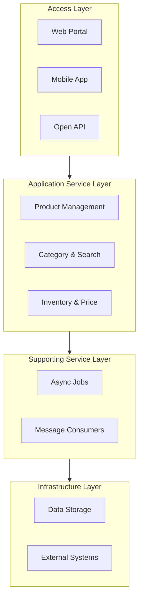

# Generate Wiki Prompt-Only Workflow

## Required flow

### Phase 1: Discovery - Scan All Components

**Goal**: Discover all components in the project before generating any documentation.

#### 1.1 gRPC Services Discovery

1. **Scan** - Find ALL proto files: `**/*.proto`
2. **Parse** - Read EVERY proto file, extract:
   - All service definitions
   - All RPC methods
   - All message types (Request/Response/DTO)
3. **Record** - Save to component inventory:
   - Service names
   - Method names + request/response types
   - All message class definitions

#### 1.2 PowerJob Processors Discovery (if present)

4. **Scan** - `**/*Job.java` or classes implementing `BasicProcessor`
5. **Identify** - For each processor, record:
   - Job name, cron expression, processor class
   - Execute method signature
   - Input/output parameter types

#### 1.3 Pulsar Consumers Discovery (if present)

6. **Scan** - `**/*Consumer.java` or `@PulsarConsumer`
7. **Identify** - For each consumer, record:
   - Topic name, subscription name, consumer class
   - Receive method signature
   - Message payload types

#### 1.4 Component Inventory Output

**Before generating any pages, output complete inventory:**

```
=== Component Inventory ===

[gRPC Services] - X services, Y methods
- ServiceA: Method1, Method2, Method3
- ServiceB: Method4, Method5
...

[PowerJob Processors] - X jobs (if present)
- JobA: cron, processorClass
...

[Pulsar Consumers] - X consumers (if present)
- ConsumerA: topic, subscription
...

[Proto Messages] - All message types
- Request/Response classes
- DTO classes
- Enum classes
```

### Phase 2: Generate Component Pages

**Generate detailed documentation for each discovered component.**

#### Parallel Generation Strategy

**When total component count ≥ 50, use subagent parallel generation:**

```
Total Components = gRPC Methods + PowerJob Processors + Pulsar Consumers

If Total Components >= 50:
    → Use SUBAGENT PARALLEL generation
Else:
    → Use sequential generation
```

**Parallel Grouping Rules (Independent Pages Only):**

Pages are considered **independent** (can be generated in parallel) if:
1. **Different gRPC Services** - Methods from different services don't depend on each other
2. **Different PowerJob Processors** - Jobs are independent
3. **Different Pulsar Consumers** - Consumers are independent

**Parallel Batches:**

```
Batch 1: ServiceA_Method1, ServiceB_Method1, ServiceC_Method1, Job1, Consumer1
Batch 2: ServiceA_Method2, ServiceB_Method2, ServiceC_Method2, Job2, Consumer2
...
```

**Same Service Methods are NOT parallel** (sequential within service):
- ServiceA_Method1 and ServiceA_Method2 → **Sequential** (same service)
- ServiceA_Method1 and ServiceB_Method1 → **Parallel** (different services)

#### Generation Steps

8. **Generate gRPC Pages** - One page per RPC method:
   - `service/{Service}/{Method}.html` for every method
   - **Sequential within same service** (to maintain consistency)
   - **Parallel across different services** (when using subagent mode)

9. **Generate PowerJob Pages** (if present) - One page per job:
   - `job/{JobClass}/index.html` for every processor (merged structure: overview + execute details)
   - **Always parallel** (jobs are independent)

10. **Generate Pulsar Pages** (if present) - One page per consumer:
    - `consumer/{Consumer}/index.html` for every consumer (merged structure: overview + receive details)
    - **Always parallel** (consumers are independent)

#### Subagent Implementation

**When parallel generation is triggered:**

```javascript
// Pseudo-code for parallel generation
const batches = createParallelBatches(components);

for (const batch of batches) {
    // Launch subagent for each independent component
    const subagents = batch.map(component => {
        return Agent({
            description: `Generate wiki page for ${component.name}`,
            prompt: generatePagePrompt(component)
        });
    });
    
    // Wait for all subagents in batch to complete
    await Promise.all(subagents);
}
```

**Subagent Prompt Requirements:**
- Include full component metadata (proto file, method signature, etc.)
- Include source URL pattern for source linking (auto-detect GitHub or GitLab from `git remote -v`)
- Include template to follow
- Subagent must save file to correct location

### Phase 3: Generate Summary Pages (LAST)

**CRITICAL: Only generate these AFTER all component pages are complete.**

These pages are second-pass aggregation outputs. Before generating them, the Agent MUST re-read the completed component pages and component inventory manifest. Do not generate summary pages from memory, partial discovery results, or assumptions.

#### 3.1 Re-read Generated Component Pages

Before writing any summary page:

1. Re-read all generated gRPC service overview pages: `wiki/service/*/index.html`
2. Re-read all generated gRPC method pages: `wiki/service/*/*.html`
3. Re-read `wiki/job/index.html` and `wiki/job/*/index.html` if PowerJob is present
4. Re-read `wiki/consumer/index.html` and `wiki/consumer/*/index.html` if Pulsar is present
5. Re-read the Phase 1 component inventory manifest or inventory notes
6. Compare generated page counts with the inventory counts
7. Stop and fix missing component pages before generating summaries

Required aggregation inputs:

| Summary Page | Required Inputs |
|--------------|-----------------|
| `01-system-architecture.html` | Completed gRPC service pages, PowerJob pages, Pulsar pages, dependency notes, message flow notes |
| `02-core-features.html` | Completed gRPC method pages, service overview pages, job pages, consumer pages, business descriptions extracted from implementations |
| `03-er-diagram.html` | All proto message types, generated service method pages, request/response mappings, shared DTO references |

11. **Generate System Architecture** (`01-system-architecture.html`)
    - **Input**: Completed component pages + component inventory manifest
    - **Include**: Service diagram showing gRPC services, PowerJob processors, Pulsar consumers
    - **Include**: Technology stack based on actual dependencies found
    - **Accuracy rule**: Every service/job/consumer shown must appear in a generated component page or the inventory manifest

12. **Generate Core Features** (`02-core-features.html`)
    - **Input**: Completed component pages + business capabilities discovered from implementations
    - **Include**: Business feature modules grouped by actual domains found in the generated pages
    - **Include**: Business process flow diagrams (sequence diagrams)
    - **Include**: Feature matrix showing business scenario support
    - **Include**: Product architecture diagrams (layered view: Access Layer / Application Service Layer / Supporting Service Layer / Infrastructure Layer)
    - **Include**: Feature comparison between system versions only when version evidence exists
    - **Include**: System integration capabilities
    - **DO NOT**: Include service counts, method statistics, or technical implementation details
    - **DO NOT**: Invent business domains that are not supported by generated component content
    - **Focus**: Business value and functional capabilities

13. **Generate ER Diagram** (`03-er-diagram.html`)
    - **Input**: All proto message types from ALL proto files + completed service method request/response mappings
    - **Include**: Complete ER diagram showing ALL proto entities and their relationships
    - **Include**: Request/Response class relationships per service
    - **Include**: Cross-service message references (shared DTOs)
    - **Accuracy rule**: Every entity and relationship must be traceable to a proto message, enum, field, or generated service page mapping

## Completeness Rules

### Component Discovery Order

**MUST follow this exact order:**
1. First: Discover ALL components (gRPC, PowerJob, Pulsar)
2. Second: Generate component detail pages
3. Third: Generate summary pages (Architecture, Features, ER)

**Why this order matters:**
- Summary pages need to reference component data
- ER diagram needs all proto message types
- Architecture needs complete component inventory

### Proto File Discovery

- **Must** search all directories: `src/`, `proto/`, `api/`, `idl/`, etc.
- **Must** use pattern `**/*.proto` to find all proto files
- **Must** report total count of proto files found
- **Must** list every proto file path before proceeding
- **Must** extract ALL message types (not just service definitions)

### Message Type Extraction (For ER Diagram)

When parsing proto files, extract ALL message types for the ER diagram:

```protobuf
// Extract these for ER diagram:
message GetUserRequest {    // Request class
    int64 user_id = 1;      // Field type and name
}

message GetUserResponse {   // Response class
    User user = 1;          // Reference to another message
}

message User {              // DTO/Entity class
    int64 id = 1;
    string name = 2;
    UserStatus status = 3;  // Enum reference
}

enum UserStatus {           // Enum class
    ACTIVE = 0;
    INACTIVE = 1;
}
```

**ER diagram requirements:**
- Include ALL message types from ALL proto files
- Show relationships: Request → Response, Message → DTO, DTO → Enum
- Use crow's foot notation for cardinality
- Group by service where applicable

### Service and Method Extraction

- **Must** parse every proto file completely
- **Must** extract every `service XXX { ... }` block
- **Must** extract every `rpc XXX` method within each service
- **Must** record request/response message types for each RPC
- **Must** report: total services count, total methods count
- **Must** list every service and method before generating

### PowerJob Discovery (Conditional)

- **Check** if PowerJob dependency exists in `pom.xml` or `build.gradle`
- **If present**: Search for processor classes
  - Look for: `implements BasicProcessor`, `@PowerJobHandler`, `ProcessContext`
  - Common patterns: `*Job.java`, `*Processor.java`
- **Must** report: total PowerJob processors found
- **Must** identify: job name, cron/config, processor class, execute method

### Pulsar Consumer Discovery (Conditional)

- **Check** if Pulsar client dependency exists in `pom.xml` or `build.gradle`
- **If present**: Search for consumer classes
  - Look for: `@PulsarConsumer`, `PulsarClient`, `Consumer`, `Message`
  - Common patterns: `*Consumer.java`
- **Must** report: total Pulsar consumers found
- **Must** identify: topic name, subscription, consumer class, receive method

### Generation Verification

- **Must** generate one page per RPC method
- **Must** generate one page per PowerJob processor (if present)
- **Must** generate one page per Pulsar consumer (if present)
- **Must** place in correct subdirectory based on component type
- **Must** verify: generated file count = discovered component count
- **Must not** skip components even if implementation details are missing (use TODO)

## Output Format Requirements

**All generated pages must be rendered as HTML**. Users should never see raw markdown or download `.md` files when clicking links.

### Fixed Page Structure

All pages **must** follow the exact structure defined in templates:

#### gRPC Service Pages (page-service.md)

```markdown
# {methodName}
## Relevant source files
# Introduction
# API Definition
## Service Definition
## Request & Response
## Implementation Class
# Data Model & Structure
# Business Logic Flow
## Sequence Diagram
# Summary
```

#### PowerJob Pages (page-powerjob.md)

```markdown
# {jobName}
## Relevant source files
# Introduction
# Task Definition
## Scheduling Configuration
## Execution Parameters
## Implementation Class
# Data Model & Structure
# Business Logic Flow
## Sequence Diagram
# Summary
```

#### Pulsar Consumer Pages (page-pulsar.md)

```markdown
# {consumerName}
## Relevant source files
# Introduction
# Consumption Definition
## Topic Configuration
## Message Structure
## Implementation Class
# Data Model & Structure
# Business Logic Flow
## Sequence Diagram
# Summary
```

#### Core Features Pages (page-features.md)

```markdown
# Core Features
## Feature Overview
## 1. Product Management
### Merchant Product Management
### Store Product Management
### Product Basic Data
### New Product System
## 2. Category & Brand Management
## 3. Search & Recommendation
## 4. Inventory & Price Management
## 5. Special Business Scenarios
## 6. Core Business Processes
## 7. Business Feature Matrix
## 8. Product Feature Architecture Diagram
## 9. Feature Comparison
## 10. System Integration Capabilities
```

**Core Features Page Structure (REQUIRED)**:

The Core Features page focuses on **business value and functional capabilities**, NOT technical implementation details like service counts or method statistics.

**Content Guidelines:**
1. **Function Overview** - High-level description of the system's purpose
2. **Feature Modules** - Grouped by business domain (not by gRPC services)
   - Each module includes: title, description, and detailed feature points
   - Use feature cards or sections, NOT tables
3. **Core Business Processes** - Include Mermaid sequence diagrams showing:
   - Product listing flow
   - Price change flow
   - Inventory deduction flow
4. **Feature Matrix** - Business scenarios vs. feature modules matrix
5. **Product Architecture Diagrams** - Layered architecture showing:
   - Access Layer (clients/entry points)
   - Application Service Layer (business capabilities)
   - Supporting Service Layer (async tasks/consumers)
   - Infrastructure Layer (data storage/external systems)
6. **Feature Comparison** - Compare different system versions/implementations
7. **System Integration** - Integration capabilities with external systems

**DO NOT Include:**
- ❌ gRPC service count statistics (e.g., "42 services")
- ❌ RPC method counts (e.g., "280+ methods")
- ❌ Detailed service listings with method numbers
- ❌ Technical architecture diagrams (belongs in System Architecture page)

**DO Include:**
- ✅ Business capability descriptions
- ✅ Functional feature lists
- ✅ Business process flow diagrams
- ✅ Feature support matrices
- ✅ Product architecture diagrams (layered view)
- ✅ System integration overview

**Architecture Diagram Format (REQUIRED)**:

Use Mermaid flowchart to show layered product architecture:



**Important**:
- Use exact section headings (including # and ## levels)
- Include **business process sequence diagrams** for key business flows
- Include **product feature architecture diagram** showing layered architecture
- Include **business feature matrix** showing feature support across scenarios
- All code blocks must have source attribution
- **All code blocks MUST specify language identifier** (e.g., \`\`\`java, \`\`\`protobuf, \`\`\`json) - never use plain \`\`\` without language
- **Product features MUST focus on business value**, not technical implementation

**Template Placeholders:**

The template `page-features.md` uses placeholders that MUST be replaced during generation:

- `{{featureDomainN}}` - Business domains extracted from service names
- `{{subFeatureN_N}}` - Specific sub-features
- `{{subFeatureN_NDescription}}` - Feature descriptions
- `{{subFeatureN_NPoints}}` - Bullet points of capabilities
- `{{businessProcessN}}` - Core business processes
- `{{scenarioN}}` - Business scenarios
- `{{moduleN}}` - Feature modules for matrix
- `{{supportN_N}}` - Support indicators (✓/△/-)
- `{{accessPointN}}` - Entry points/clients
- `{{integrationSystemN}}` - External system integrations

**How to Extract from Code:**
1. **Business Domains**: Analyze gRPC service names
   - e.g., `MerchantItemService`, `ShopItemService` → "Product Management"
   - e.g., `PriceTagService` → "Price Management"
2. **Capabilities**: Analyze method names
   - e.g., `queryMerchantItem`, `batchUpdateItemStatus` → Query, Update
3. **System Versions**: Look for patterns in service names
   - e.g., `Sg` prefix → "New Product System"
   - e.g., `Takeaway` prefix → "Delivery Service"
4. **Integrations**: Identify external system calls
   - e.g., calls to "price-center" → "Price Center"

### Option 1: Static HTML Generation (Recommended)

Generate complete HTML files for every page:

```
wiki/
├── index.html              # Main navigation
├── 01-system-architecture.html  # Complete HTML with styling
├── 02-core-features.html       # Complete HTML with styling
├── 03-er-diagram.html          # Complete HTML with styling
└── service/
    └── ServiceName/
        ├── index.html      # Service overview
        └── MethodName.html # Complete HTML per method
```

### Option 2: SPA with Router

Single `index.html` that dynamically renders markdown:

```
wiki/
├── index.html              # SPA with router
├── assets/
│   ├── css/style.css
│   └── js/
│       ├── nav.js
│       └── router.js       # Handles URL routing
└── content/                # Markdown content (not directly accessible)
    ├── 01-system-architecture.md
    └── service/
        └── ServiceName/
            └── MethodName.md
```

**Requirements for SPA approach:**
- URL routing must work (e.g., `/#/service/UserService/GetUser`)
- All links must be intercepted and rendered in-page
- Direct access to `.md` files should redirect to SPA or show rendered content

## Directory Structure Rules

### Component Type Grouping

#### gRPC Services (Always)

Group RPC method documentation by **gRPC Service name**:

```
service/
├── {ServiceName}/          # One directory per gRPC service
│   ├── index.html          # Service overview page
│   └── {MethodName}.html   # One HTML file per RPC method
└── ...
```

Rules:
- Directory name = gRPC service name (from proto `service XXX`)
- File name = RPC method name (from proto `rpc XXX`)
- All methods from the same service go into the same folder
- **Always create** - gRPC is the primary focus of this skill

#### PowerJob Processors (Conditional)

Only create `job/` directory when PowerJob dependency is detected:

```
job/
├── {JobClassName}/         # One directory per PowerJob processor
│   └── index.html          # Merged job page (overview + execute method details)
└── ...
```

Rules:
- **Only create if** project uses PowerJob (check `pom.xml`/`build.gradle`)
- Directory name = Processor class name (e.g., `OrderSyncJob`)
- Extract from: classes implementing `BasicProcessor` or `PowerJobProcessor`
- Must identify: Job name, cron expression, processor class, execute method
- Content should analyze: job purpose, scheduling logic, business implementation
- **Merged Structure**: Single `index.html` contains both job overview and execute method details (no separate execute.html)

Detection patterns:
- Dependency: `tech.powerjob:powerjob-worker`
- Class implements: `BasicProcessor`, `PowerJobProcessor`
- Annotation: `@PowerJobHandler`
- Method: `ProcessResult execute(ProcessContext context)`

#### Pulsar Consumers (Conditional)

Only create `consumer/` directory when Pulsar client dependency is detected:

```
consumer/
├── {ConsumerClassName}/    # One directory per Pulsar consumer
│   └── index.html          # Merged consumer page (overview + receive method details)
└── ...
```

Rules:
- **Only create if** project uses Pulsar (check `pom.xml`/`build.gradle`)
- Directory name = Consumer class name (e.g., `OrderEventConsumer`)
- Extract from: classes annotated with `@PulsarConsumer` or using `Consumer` API
- Must identify: Topic name, subscription name, consumer class, receive method
- Content should analyze: message purpose, consumption logic, business handling
- **Merged Structure**: Single `index.html` contains both consumer overview and receive method details (no separate consume.html)

Detection patterns:
- Dependency: `org.apache.pulsar:pulsar-client`
- Annotation: `@PulsarConsumer`, `@PulsarListener`
- Class uses: `PulsarClient`, `Consumer`, `Message`
- Method: handles message consumption (often annotated with `@PulsarConsumer`)

## Acceptance rules

- Do not claim a method exists unless a file path is found.
- Do not invent exact line ranges when the tool output is ambiguous.
- If multiple candidates exist, list them and explain the chosen one.
- If implementation is missing, render `TODO` rather than fabricating content.

### Mermaid Diagram Rendering (Critical)

All Mermaid diagrams must render correctly, not display as raw code.

#### Mermaid Syntax Rules (Must Follow)

When generating Mermaid sequence diagrams, follow these strict rules to avoid syntax errors:

1. **Participant Names**: Use single words without spaces or special characters
   ```mermaid
   # Good
   participant Client as Client
   participant ApiService as ApiService
   
   # Bad - spaces cause issues
   participant Client as API Client
   participant Service as Business Service
   ```

2. **No Angle Brackets in Messages**: Avoid `<>` in message text (conflicts with HTML)
   ```mermaid
   # Good
   Service->>Repository: queryOrUpdate
   Consumer->>Service: processMessage
   
   # Bad - angle brackets break HTML rendering
   Service->>Repository: List<Item> items
   Consumer->>Service: Message<String> msg
   ```

3. **Avoid Special Characters**: Don't use parentheses, quotes, or complex expressions in participant aliases
   ```mermaid
   # Good
   participant Broker as Broker
   participant Consumer as Consumer
   
   # Bad
   participant Broker as Pulsar Broker
   participant Consumer as Message Consumer
   ```

4. **Keep Message Text Simple**: Use camelCase or snake_case without spaces when possible
   ```mermaid
   # Good
   Client->>Service: initSiteItemSupplier
   Service->>Repository: selectAll(shardId, offset)
   
   # Acceptable with spaces
   Client->>Service: forward request
   ```

5. **Loop Syntax**: Keep loop labels simple
   ```mermaid
   # Good
   loop process each item
       Service->>DB: query
   end
   
   # Good
   loop batch processing
       Service->>DB: update
   end
   ```

6. **Alt/Else Blocks**: Use simple condition descriptions
   ```mermaid
   # Good
   alt TYPE_ES_CREATE
       Consumer->>Service: esInsert
   else TYPE_ES_UPDATE
       Consumer->>Service: esUpdate
   end
   ```

#### Required HTML Structure

Every page with Mermaid must include:

```html
<!-- 1. Mermaid library -->
<script src="https://cdn.jsdelivr.net/npm/mermaid@10/dist/mermaid.min.js"></script>

<!-- 2. Initialization -->
<script>
mermaid.initialize({
    startOnLoad: true,
    theme: 'default',
    securityLevel: 'loose'
});
</script>

<!-- 3. Diagram container -->
<div class="mermaid">
graph TB
    A --> B
</div>
```

#### SPA Approach

If using SPA, call `mermaid.init()` after loading content:

```javascript
// After loading markdown content
mermaid.init(undefined, document.querySelectorAll('.mermaid'));
```

#### Verification Steps

Before finishing, verify:
- [ ] Mermaid diagrams render as actual graphics (not code blocks)
- [ ] No raw Mermaid syntax visible to users
- [ ] All diagram types (flowchart, sequence, ER) render correctly

### Proto File References

Format:
```markdown
**Proto Source**: [filename.proto (L{line})]({full-url})
```

Example:
```markdown
**Proto Source**: [user.proto (L42)](https://github.com/owner/repo/blob/main/proto/user.proto#L42)
```

### Java Implementation References

For gRPC entry method:
```markdown
**Source Location**: [ClassName.java (L{start}-{end})]({full-url})
```

For business logic method:
```markdown
**Source Location**: [ServiceImpl.java (L{start}-{end})]({full-url})
```

### URL Construction

Use the pattern (auto-detect from `git remote -v`):
```
GitHub: {git-host}/{owner}/{repo}/blob/{branch}/{path}#L{line-start}[-{line-end}]
GitLab: {git-host}/{group}/{project}/-/blob/{branch}/{path}#L{line-start}[-{line-end}]
```

Note: GitLab URLs contain `/-/blob/` while GitHub URLs use `/blob/`.

Only include line numbers if detected with confidence. When uncertain, link to file only.

### When Links Cannot Be Generated

If Git remote is not detected or file path is unknown:
```markdown
**Proto Source**: TODO (manually add)
**Source Location**: TODO (manually add)
```

## Source Reference Section (Required)

Every generated page **must** include a "Relevant source files" section listing all source files used to generate that page.

### Format

```markdown
## Relevant source files

The following files were used as context for generating this wiki page:

- [`path/to/proto/file.proto`](https://github.com/{owner}/{repo}/blob/{branch}/path/to/proto/file.proto) - Proto service definition
- [`path/to/GrpcImpl.java`](https://github.com/{owner}/{repo}/blob/{branch}/path/to/GrpcImpl.java) - gRPC implementation class
- [`path/to/BusinessService.java`](https://github.com/{owner}/{repo}/blob/{branch}/path/to/BusinessService.java) - Business logic implementation
```

### Requirements

- [ ] List **all** source files read during generation
- [ ] Include **relative paths** from project root
- [ ] Add **brief description** of each file's role
- [ ] Use **bullet points** for readability
- [ ] **Each file must be a clickable link to source repository (GitHub or GitLab)**
- [ ] **For HTML**: Use `<a href="{url}" target="_blank">{file}</a>` format
- [ ] **For Markdown**: Use `[{file}]({url})` format
- [ ] **CRITICAL for Index Pages**: The "Relevant Source Files" section in service/consumer/job **index pages** MUST include clickable links to actual source files (not just plain text)

### HTML Example (for static HTML generation)

```html
## Relevant source files

<ul class="file-list">
    <li><a href="https://github.com/owner/repo/blob/master/item-proto/src/main/proto/init/InitService.proto" target="_blank">item-proto/src/main/proto/init/InitService.proto</a> - Proto service definition</li>
    <li><a href="https://github.com/owner/repo/blob/master/item-server/src/main/java/.../ApiInitServiceImpl.java" target="_blank">item-server/src/main/java/.../ApiInitServiceImpl.java</a> - gRPC implementation</li>
</ul>
```

### Example for gRPC Service

```markdown
## Relevant source files

- [`item-proto/src/main/proto/init/InitService.proto`](https://github.com/owner/repo/blob/master/item-proto/src/main/proto/init/InitService.proto) - Proto service definition
- [`item-server/src/main/java/com/example/item/server/interfaces/grpc/init/ApiInitServiceImpl.java`](https://github.com/owner/repo/blob/master/item-server/src/main/java/com/example/item/server/interfaces/grpc/init/ApiInitServiceImpl.java) - gRPC implementation
- [`item-server/src/main/java/com/example/item/server/application/InitApplicationService.java`](https://github.com/owner/repo/blob/master/item-server/src/main/java/com/example/item/server/application/InitApplicationService.java) - Business logic
```

### Code Attribution

**Any code or configuration copied into the documentation MUST include source attribution with line numbers.**

Format:
```
Sources: {file-path}:{start-line}-{end-line}
```

Examples:
```
Sources: item-proto/src/main/proto/init/InitService.proto:4-7
Sources: src/main/java/com/example/ServiceImpl.java:45-67
Sources: config/application.yml:12-18
```

#### Requirements

- **Every code block** must have a "Sources:" line below it
- Include **exact file path** (relative to project root)
- Include **line number range** (start-end)
- If single line: use `{file}:{line}` format
- **Link to source repository** (GitHub or GitLab) when generating HTML (auto-detect from `git remote -v`)

**HTML Format Example**:
```html
<div class="source-ref">Sources: <a href="https://github.com/{owner}/{repo}/blob/{branch}/path/to/File.java#L45-67" target="_blank">File.java:45-67</a></div>
```

**Important**: The anchor in the URL (`#L{start}-{end}`) should only appear once, do not duplicate. The link text (text inside `<a>` tag) can include line number information, but the URL (`href` attribute) should not duplicate line numbers.
- ✅ Correct: `href=".../File.java#L45-67"` → links to `#L45-67`
- ❌ Wrong: `href=".../File.java#L45-67#L45-67"` → duplicated line number anchor

Example source link:
```
GitHub: Sources: https://github.com/username/example-item/blob/master/item-proto/src/main/proto/init/InitService.proto#L4-7
GitLab: Sources: https://gitlab.example.com/username/example-item/-/blob/master/item-proto/src/main/proto/init/InitService.proto#L4-7
```

#### How to Get Source URL

1. Run `git remote -v` to get the remote URL
2. Parse the remote URL format:
   - GitHub SSH: `git@github.com:owner/repo.git`
   - GitHub HTTPS: `https://github.com/owner/repo.git`
   - GitLab SSH: `git@gitlab.example.com:group/project.git`
   - GitLab HTTPS: `https://gitlab.example.com/group/project.git`
3. Convert to blob URL (auto-detect platform):
   ```
   GitHub: https://github.com/{owner}/{repo}/blob/{branch}/{path}#L{start}-{end}
   GitLab: https://gitlab.example.com/{group}/{project}/-/blob/{branch}/{path}#L{start}-{end}
   ```
   Note: GitLab URLs contain `/-/blob/` while GitHub URLs use `/blob/`.
4. Get current branch: `git rev-parse --abbrev-ref HEAD`

#### Mandatory for

- Proto definitions
- Java method implementations
- Configuration files (yaml, properties, xml)
- SQL statements
- JSON/XML data
- Any other project-specific content

### Example for PowerJob

```markdown
## Relevant source files

- [`item-server/src/main/java/com/example/item/server/job/OrderSyncJob.java`](https://github.com/owner/repo/blob/master/item-server/src/main/java/com/example/item/server/job/OrderSyncJob.java) - PowerJob processor implementation
- [`item-server/src/main/resources/powerjob-worker.properties`](https://github.com/owner/repo/blob/master/item-server/src/main/resources/powerjob-worker.properties) - Job configuration
```

### Example for Pulsar Consumer

```markdown
## Relevant source files

- [`item-server/src/main/java/com/example/item/server/consumer/OrderEventConsumer.java`](https://github.com/owner/repo/blob/master/item-server/src/main/java/com/example/item/server/consumer/OrderEventConsumer.java) - Pulsar consumer implementation
- [`item-server/src/main/java/com/example/item/server/event/OrderEvent.java`](https://github.com/owner/repo/blob/master/item-server/src/main/java/com/example/item/server/event/OrderEvent.java) - Event message definition
```
