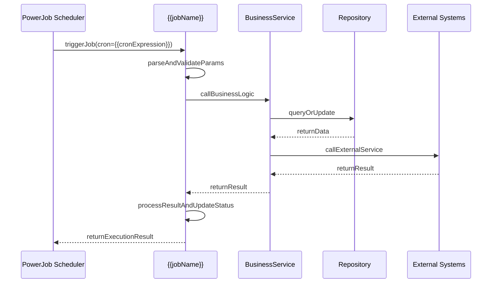

# {{jobName}}

## Relevant source files

The following files were used as context for generating this wiki page:

{{sourceFilesList}}

**Format**: Each source file should be a clickable link to source repository (auto-detect GitHub or GitLab from `git remote -v`):
```markdown
GitHub:
- [path/to/Job.java](https://github.com/{owner}/{repo}/blob/{branch}/path/to/Job.java) - description
GitLab:
- [path/to/Job.java](https://{git-host}/{group}/{project}/-/blob/{branch}/path/to/Job.java) - description
```

**HTML Format** (for static HTML generation):
```html
<!-- GitHub -->
<li><a href="https://github.com/{owner}/{repo}/blob/{branch}/path/to/Job.java" target="_blank">path/to/Job.java</a> - description</li>
<!-- GitLab -->
<li><a href="https://{git-host}/{group}/{project}/-/blob/{branch}/path/to/Job.java" target="_blank">path/to/Job.java</a> - description</li>
```

# Task Overview

{{description}}

{{jobOverview}}

## Business Scenario

{{businessScenario}}

# Scheduling Configuration

| Config Item | Value | Description |
|--------|-----|------|
| Job Name | {{jobName}} | PowerJob task name |
| Cron Expression | {{cronExpression}} | Execution schedule configuration |
| Processor Class | {{processorClass}} | Implements BasicProcessor interface |
| Job Type | {{jobType}} | BASIC / MAP / MAP_REDUCE |
| Sharding Strategy | {{shardingStrategy}} | Sharding parameters (if any) |

**Configuration Source**: [{{configFile}} (L{{configLine}})]({{configUrl}})

# Execution Parameters

## Job Parameters
{{jobParamsTable}}

## Execution Context
{{contextTable}}

# Implementation Class

## Processor Implementation

```java
{{processorImplementation}}
```

**Source Location**: [{{processorClass}}.java (L{{startLine}}-{{endLine}})]({{sourceUrl}})

## Business Logic Layer

```java
{{businessLogic}}
```

**Source Location**: [{{bizClass}}.java (L{{bizStart}}-{{bizEnd}})]({{bizUrl}})

# Data Model & Structure

{{dataModelDescription}}

```java
{{dataStructureDefinition}}
```

**Sources**: {{dataStructureSource}}

# Business Logic Flow

{{flowDescription}}

## Sequence Diagram



## Core Implementation

### process(TaskContext) - Main Entry

```java
{{executeMethodFull}}
```

**Sources**: {{executeMethodSource}}

{{helperMethods}}

# Summary

{{conclusion}}

## Key Points

{{keyPoints}}

## Notes

{{warnings}}

## Scheduling Example

{{scheduleExample}}

## Monitoring & Alerts

{{monitoring}}

# Related Jobs

{{relatedJobs}}
