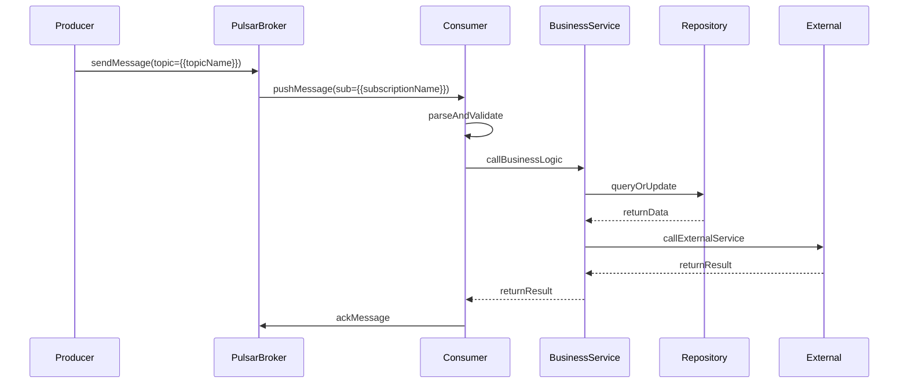

# {{consumerName}}

## Relevant source files

The following files were used as context for generating this wiki page:

{{sourceFilesList}}

**Format**: Each source file should be a clickable link to source repository (auto-detect GitHub or GitLab from `git remote -v`):
```markdown
GitHub:
- [path/to/Consumer.java](https://github.com/{owner}/{repo}/blob/{branch}/path/to/Consumer.java) - description
GitLab:
- [path/to/Consumer.java](https://{git-host}/{group}/{project}/-/blob/{branch}/path/to/Consumer.java) - description
```

**HTML Format** (for static HTML generation):
```html
<!-- GitHub -->
<li><a href="https://github.com/{owner}/{repo}/blob/{branch}/path/to/Consumer.java" target="_blank">path/to/Consumer.java</a> - description</li>
<!-- GitLab -->
<li><a href="https://{git-host}/{group}/{project}/-/blob/{branch}/path/to/Consumer.java" target="_blank">path/to/Consumer.java</a> - description</li>
```

# Introduction

{{description}}

{{consumerOverview}}

# Consumption Definition

## Topic Configuration

- **Topic Name**: {{topicName}}
- **Subscription Name**: {{subscriptionName}}
- **Subscription Type**: {{subscriptionType}}
- **Consumer Class**: {{consumerClass}}
- **Consumption Mode**: {{consumeMode}}

**Configuration Source**: [{{configFile}} (L{{configLine}})]({{configUrl}})

## Message Structure

### Message Format
{{messageTable}}

### Message Properties
{{messagePropertiesTable}}

## Implementation Class

### Consumer Implementation

```java
{{consumerImplementation}}
```

**Source Location**: [{{consumerClass}}.java (L{{startLine}}-{{endLine}})]({{sourceUrl}})

### Business Logic Layer

```java
{{businessLogic}}
```

**Source Location**: [{{bizClass}}.java (L{{bizStart}}-{{bizEnd}})]({{bizUrl}})

# Data Model & Structure

{{dataModelDescription}}

```java
{{receiveMethodSignature}}
```

Sources: {{receiveMethodSource}}

{{messageStructureDefinition}}

Sources: {{messageStructureSource}}

# Business Logic Flow

{{flowDescription}}

## Sequence Diagram



# Summary

{{conclusion}}

## Key Points

{{keyPoints}}

## Notes
{{warnings}}

## Consumption Configuration Example
{{consumerConfigExample}}

## Retry & Dead Letter
{{retryPolicy}}
