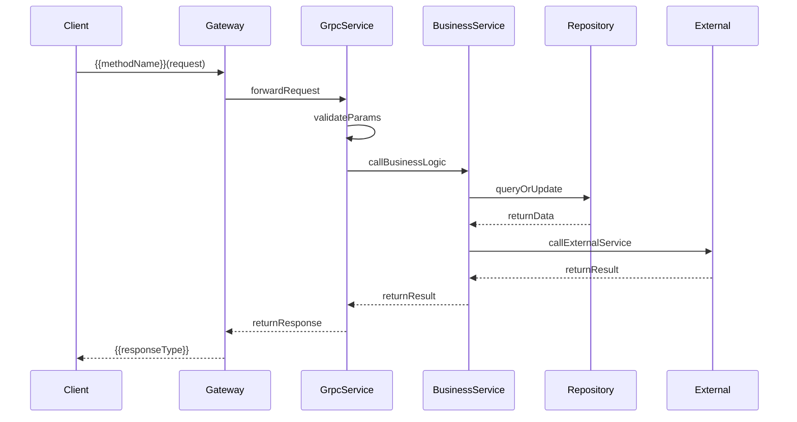

# {{methodName}}

## Relevant source files

The following files were used as context for generating this wiki page:

{{sourceFilesList}}

**Format**: Each source file should be a clickable link to source repository (auto-detect GitHub or GitLab from `git remote -v`):
```markdown
GitHub:
- [path/to/file.proto](https://github.com/{owner}/{repo}/blob/{branch}/path/to/file.proto) - description
- [path/to/Implementation.java](https://github.com/{owner}/{repo}/blob/{branch}/path/to/Implementation.java) - description

GitLab:
- [path/to/file.proto](https://{git-host}/{group}/{project}/-/blob/{branch}/path/to/file.proto) - description
- [path/to/Implementation.java](https://{git-host}/{group}/{project}/-/blob/{branch}/path/to/Implementation.java) - description
```

**HTML Format** (for static HTML generation):
```html
<!-- GitHub -->
<li><a href="https://github.com/{owner}/{repo}/blob/{branch}/path/to/file.proto" target="_blank">path/to/file.proto</a> - description</li>
<!-- GitLab -->
<li><a href="https://{git-host}/{group}/{project}/-/blob/{branch}/path/to/file.proto" target="_blank">path/to/file.proto</a> - description</li>
```

# Introduction

{{summary}}

{{description}}

**Use Cases**: Describe the typical usage scenarios of this API

# API Definition

## Service Definition

{{serviceDefinition}}

**Proto Source**: [{{protoFile}} (L{{protoLine}})]({{protoUrl}})

## Request & Response

### Request Parameters

| Field | Type | Required | Description | Example |
|------|------|------|------|--------|
{{requestTable}}

**Notes**:
- Required column: Mark "Yes" or "No"
- Description column: Include constraints, value ranges, etc.
- Example column: Provide realistic example values

### Request Parameter Enum Description (if applicable)

If the request parameters contain enum types, provide enum value mapping table:

| Value | Name | Description |
|----|------|------|
| 0 | UNKNOWN | Unknown |
| 1 | ENABLE | Enabled |
| 2 | DISABLE | Disabled |

### Response Parameters

| Field | Type | Description | Example |
|------|------|------|--------|
{{responseTable}}

### Response DTO Structure Details

For complex response DTO types, provide detailed field descriptions:

| Field | Type | Description | Example |
|------|------|------|--------|
| id | int64 | Primary Key ID | 100001 |
| name | string | Name | "Example name" |
| status | int32 | Status, 1=enabled, 2=disabled | 1 |

### Response DTO Enum Description (if applicable)

| Value | Name | Description |
|----|------|------|
| 0 | UNKNOWN | Unknown |
| 1 | CS_ENABLE | Enabled |
| 2 | CS_DISABLE | Disabled |

## Implementation Class

### gRPC Entry Layer

```java
{{grpcEntryCode}}
```

**Source Location**: [{{grpcClass}}.java (L{{grpcStart}}-{{grpcEnd}})]({{grpcUrl}})

### Business Logic Layer

```java
{{businessLogicCode}}
```

**Source Location**: [{{bizClass}}.java (L{{bizStart}}-{{bizEnd}})]({{bizUrl}})

# Request & Response Examples

## Request Example

```json
{
  "field1": 1001,
  "field2": "example",
  "field3": [1, 2, 3]
}
```

## Response Example (Success)

```json
{
  "success": true,
  "result": {
    "id": 100001,
    "name": "Example name"
  }
}
```

## Response Example (Failure)

```json
{
  "success": false,
  "error": {
    "code": 400,
    "message": "Error description"
  }
}
```

# Error Handling

| Scenario | Error Code | Error Message | Suggestion |
|------|--------|----------|----------|
| Empty parameters | 400 | Specific error message | Check request parameters |
| Data not found | 404 | Specific error message | Verify data exists |
| Insufficient permissions | 403 | Specific error message | Check permission configuration |

# Data Model & Structure

{{dataModelDescription}}

```protobuf
{{protoMessageDefinition}}
```

Sources: {{protoMessageSource}}

# Business Logic Flow

{{flowDescription}}

## Sequence Diagram



# Business Rules & Notes

{{businessRules}}

**Common Rules Examples** (replace based on actual business):
- **Return order**: Results are returned in the order of the input IDs
- **Batch limit**: Recommended to query no more than 100 IDs at a time
- **Non-existent data**: Non-existent IDs will not appear in the return list
- **Duplicate handling**: If there are duplicate IDs, they will also appear in the results

# Similar Interface Comparison (if applicable)

| Interface | Input | Output Characteristics | Use Case |
|------|------|----------|----------|
| methodA | ID list | Single detail | Query details by known ID |
| methodB | ID list | Assembled path | Display complete path |
| methodC | Single ID | Single detail | Query single object |

# Summary

{{conclusion}}

## Key Points

{{keyPoints}}

## Notes

{{warnings}}

- Pay attention to field constraints and validation rules
- Understand the specific meaning of enum values
- Handle possible error scenarios

## Call Example

{{example}}
