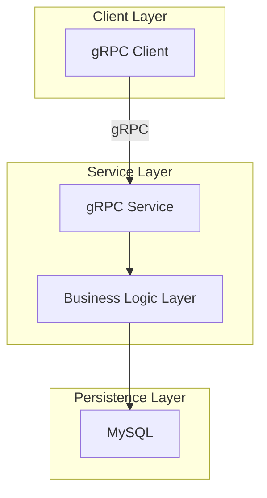

# System Architecture

## Project Overview

generate-wiki is a microservice project based on gRPC protocol.

## Overall Architecture Diagram

## Module Division

| Module | Description |
|------|------|
| API Layer | Proto definitions and gRPC service interfaces |
| Service Layer | Business logic implementation |
| Persistence Layer | Database access |

## Technology Stack

- **Communication Protocol**: gRPC
- **Development Language**: Java
- **Build Tool**: Gradle
