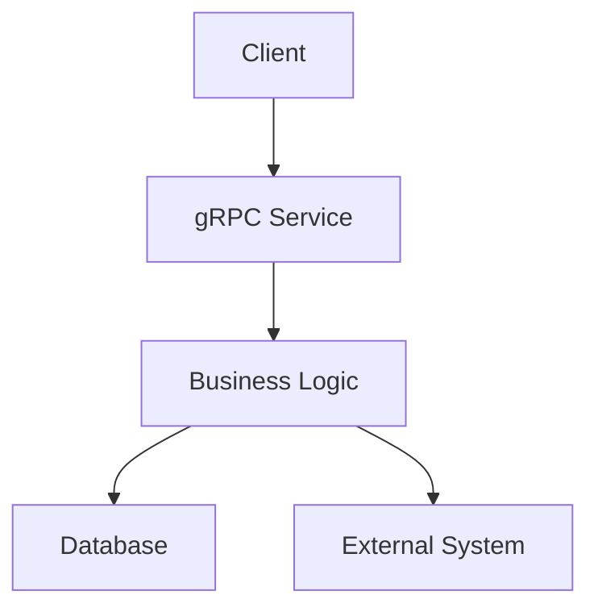

# Core Features

## Feature Module List

### NestedService

- **methodWithOptions**: Method with option braces
- **normalMethod**: Normal method

### TestService

- **getUser**: Get user information
- **createUser**: Create user
- **updateUser**: Update user information
- **deleteUser**: Delete user

### AdminService

- **queryUsers**: Query all users
- **disableUser**: Disable user

## Core Business Processes

## Detailed Description

TODO: Add detailed description for each feature
