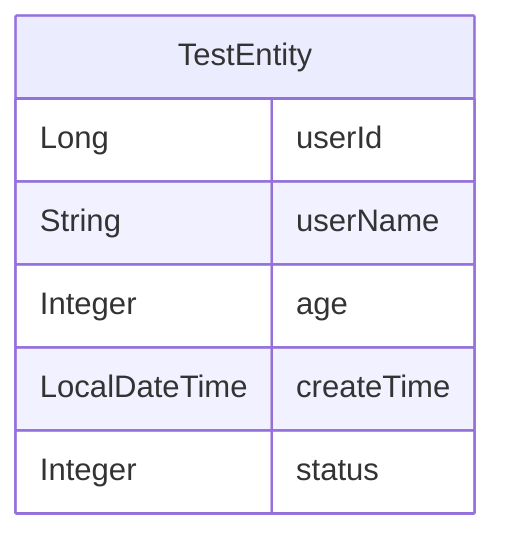

# ER Diagram

## Entity Relationship Diagram

## Core Entities

### TestEntity

| Field | Type | Description |
|------|------|------|
| userId | Long | |
| userName | String | |
| age | Integer | |
| createTime | LocalDateTime | |
| status | Integer | |

