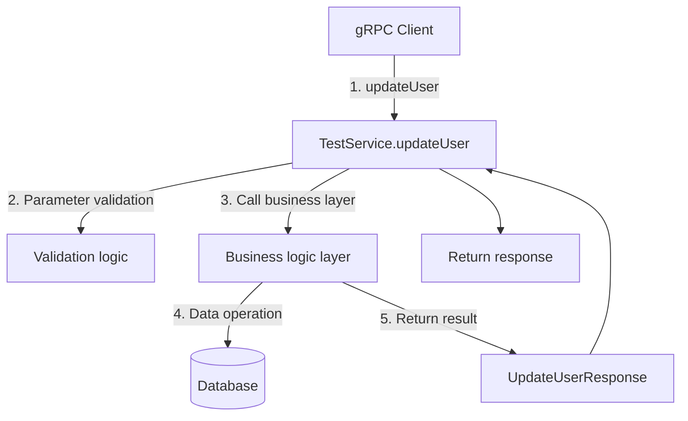

# updateUser

## Interface Definition

Update user information

### Proto Definition

```protobuf
service TestService {
    rpc updateUser(UpdateUserRequest) returns (UpdateUserResponse){}
}

message UpdateUserRequest {
    int64 userId = 1;
    string userName = 2;
}

message UpdateUserResponse {
    bool success = 1;
}
```

**Proto Source**: [app.proto](https://github.com/username/generate-wiki/blob/main/message-queue-api/src/main/proto/app.proto)

---

## Call Flow



### Flow Description

| Step | Component | Description |
|------|------|------|
| 1 | gRPC Client | Call updateUser RPC interface |
| 2 | TestService | Receive gRPC request, parameter validation |
| 3-4 | Business logic layer | Execute core business logic |
| 5 | Return | Package response result |

---

## Core Logic Implementation

### 1. gRPC Entry Layer

```java
// TODO: Add gRPC entry code
public UpdateUserResponse updateUser(UpdateUserRequest request) {
    // Implementation code
}
```

**Source Location**: [TestServiceGrpcImpl.java](#)

### 2. Business Logic Layer

```java
// TODO: Add business logic implementation
public UpdateUserResponse updateUser(UpdateUserRequest request) {
    // Implementation code
}
```

**Source Location**: [Service.java](#)

---

## Data Model

### UpdateUserRequest

| Field | Type | Description | Required |
|------|------|------|------|
| userId | int64 |  |  |
| userName | string |  |  |

### UpdateUserResponse

| Field | Type | Description |
|------|------|------|
| success | bool |  |

---

## Call Example

### Java Client

```java
// Create gRPC Channel
ManagedChannel channel = ManagedChannelBuilder
    .forAddress("localhost", 9090)
    .usePlaintext()
    .build();

try {
    // Create client Stub
    MqManagerServiceGrpc.MqManagerServiceBlockingStub stub =
        MqManagerServiceGrpc.newBlockingStub(channel);

    // Build request
    UpdateUserRequest request = UpdateUserRequest.newBuilder()
        .setUserId(1)
        .setUserName("example")
        .build();

    // Call RPC method
    UpdateUserResponse response = stub.updateUser(request);

    // Handle response
    System.out.println("Response: " + response);
} finally {
    channel.shutdown();
}
```

### curl (via gateway)

```bash
# gRPC interface needs to be called via gRPC client
# For HTTP access, use the REST interface forwarded by the gateway
```

### Response Example

```json
{
  "success": true
}
```

---

## Summary

### Use Cases

1. **Modify configuration**: Adjust configuration parameters of existing resources
2. **Permission changes**: Update authorized application lists or access permissions

### Key Notes

<div class="info-box warning">
<strong>Warning: Notes</strong>

1. Ensure the input parameters are correct
2. Check permissions before calling
</div>

### Related APIs

| API | Description |
|------|------|
| [methodWithOptions](methodWithOptions.md) | Method with option braces |
| [normalMethod](normalMethod.md) | Normal method |
| [getUser](getUser.md) | Get user information |
| [createUser](createUser.md) | Create user |
| [deleteUser](deleteUser.md) | Delete user |
